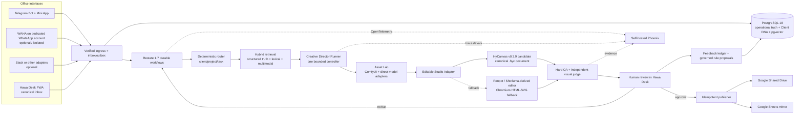

# Decision Summary

**Decision date:** 2026-09-03  
**Status:** Architecture approved; editable-studio admission conditional on Phase 0 proof

## Corrected decision

The system is not organized around a popular communication app or a popular AI framework. It is organized around four office-owned assets:

1. **Hawa Desk**, the canonical task and approval interface.
2. **Client DNA**, the authoritative and versioned memory of every client.
3. **The editable creative document**, normally `.hyc`, containing real text and independently editable nodes.
4. **The durable workflow journal**, which makes every step recoverable and replayable.

## Why the previous conventional architecture was rejected

- Slack would make the office’s workflow inherit Slack’s channel model and availability.
- A hosted template renderer would make editability and exports dependent on a vendor-specific document format.
- A frontier-model name written directly into business logic would age within weeks.
- A multi-agent graph would add failure modes without improving deterministic operations.
- A vector database treated as “memory” would lose authoritative rules, versions, approvals, and negative feedback.
- CI from a young editor cannot substitute for real-browser mixed-direction testing.

## Exact selected stack

| Layer | Selected implementation | Why this is selected |
|---|---|---|
| Canonical office UI | **Hawa Desk:** React 19, Vite 8, TanStack Router/Query, PWA | Internal software needs no SSR or SEO. A static SPA is simpler, faster to restore, and easier to embed/open from Telegram. |
| API ingress | **Hono on Node 24 LTS**, Zod/OpenAPI | Thin, typed webhook and office API surface; business durability lives in Restate rather than framework middleware. |
| Durable execution | **Restate 1.7.x**, self-hosted, TypeScript SDK | Journals external calls and timers, survives restarts, supports manual pause/resume/restart and fine-grained flow control without a separate queue stack. |
| Operational database | **PostgreSQL 18 + pgvector 0.8.6** | One ACID boundary for tasks, rules, audit, full-text search, vectors, outbox, permissions, and point-in-time recovery. |
| SQL access | **Kysely + versioned SQL migrations** | Type-safe SQL while preserving visible database design, RLS, constraints, and hand-auditable migrations. |
| Editable studio | **HyCanvas v0.3.9**, pinned, behind `DesignStudioAdapter` | Open `.hyc` JSON, real editable nodes, exports, brand kits, APIs/MCP, a Go backend, Postgres, and a single self-hostable binary. It must pass the proof sprint before live use. |
| Design method | **Editable-Design reconstruction method**, adapted—not embedded as the platform | Its “visual prior, pixels never ship, semantic reconstruction, deterministic verification” method is stronger than flat generation. |
| Studio fallback | **Penpot**, then a Shotluma-derived focused editor; Chromium HTML/SVG renderer for exact RTL | Prevents HyCanvas from becoming a single point of architectural lock-in. |
| Asset graph | **ComfyUI**, pinned workflows and allowlisted nodes only | Lets the office combine local and hosted image generation/editing in reproducible JSON graphs. It is an asset worker, not the workflow engine. |
| Model access | **Direct provider adapters** plus local workers | Avoids gateway lock-in and preserves full provider features, snapshots, safety settings, images, caching, and error semantics. |
| Fast reasoning | **Gemini 3.8 Flash** provisional | Newly GA, multimodal, long context, structured outputs and tool calling; final selection depends on office evaluation. |
| Deep creative reasoning | **GPT-5.6 Sol** provisional | Strong complex professional reasoning, vision, structured outputs and snapshot support; use only where the value justifies cost. |
| Independent visual judge | **Claude Opus 5** provisional | Different model family reduces correlated creator/judge failures; must win blind office evaluation. |
| Local retrieval | **Qwen3-VL-Embedding-2B + Qwen3-VL-Reranker-2B**, benchmarked against 8B and UEmbed | Multimodal and permissively licensed while fitting a modest GPU; Postgres lexical search covers sparse/exact retrieval. |
| Document ingestion | **Docling / docling-serve**, local | Strong multi-format parsing, layout/table understanding, lossless JSON, and local operation. |
| AI observability/evals | **OpenTelemetry + self-hosted Arize Phoenix** | Office-owned traces, datasets, experiments, prompt versions, evaluations, and provider-neutral instrumentation. |
| Primary chat bridge | **Telegram Bot API + optional Mini App** | Official API, deterministic update IDs, webhook secret, rich UI, and direct launch of Hawa Desk. |
| WhatsApp bridge | **WAHA**, dedicated account, optional and isolated | Reads existing office groups, but it is unofficial and operationally risky; never canonical and always protected by reconciliation and a kill switch. |
| Files | Local content-addressed staging + **Google Shared Drive** publication | No extra object-store dependency for the MVP; local staging is backed up, while approved deliverables remain in the office’s existing Drive. |
| Reporting | Direct **Google Sheets API** mirror | Staff familiarity without turning a spreadsheet into the source of truth. |
| Edge security | **Caddy + Tailscale/office VPN**, Google Workspace OIDC | Minimal TLS/network surface and no public admin UI. |
| Backups | pgBackRest + restic + encrypted off-site copy | WAL/PITR for data, content backups for files/config, and automated restore drills. |

## Admission gates

The system may enter office pilot only after all of these are true:

- HyCanvas or its selected fallback passes every critical test in `docs/21_HYCANVAS_PROOF_SPRINT.md`.
- No cross-client retrieval is observed in automated adversarial tests.
- Duplicate webhooks and process restarts produce one task and one publication.
- All 40 supplied RTL cases and at least 20 real Sorani designs pass native-speaker review.
- A 200-task historical model tournament selects each model role.
- Backup restoration succeeds on a clean host.
- Drive publication and Sheet updates reconcile after injected network failures.

## Confidence

- **Architecture:** 93%
- **Restate/PostgreSQL operational core:** 91%
- **HyCanvas as the final studio before proof sprint:** 78%
- **Provisional model choices before company benchmark:** 65%
- **Ability to replace any failed model or editor without redesigning the core:** 94%
