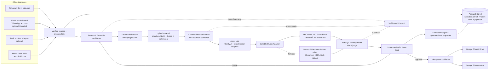

> **Current studio decision (2026-09-13, ADR 025): Canva is the only active editor/export studio. Telegram is the user-facing request/result channel; Hawa retains operational records. All HyCanvas, Figma and Penpot selection/fallback passages below are historical and must not be re-enabled. Their original implementation is archived under `archive/retired-studios/2026-09-13/`.**

# Hawa Creative OS — Master Specification

**Version:** 1.0.0  
**Research freeze:** 2026-09-03  
**Purpose:** Authoritative overview and build map. Detailed normative requirements live in the numbered documents and machine-readable contracts.

## 1. Mission

Create the office’s most capable and dependable AI graphic-production worker without forcing the office to adopt a specific chat platform, SaaS renderer, model provider, or multi-agent framework.

## 2. Architectural invariants

1. **The office inbox is canonical.** Chat products are adapters, never the database or state machine.
2. **Every final design remains editable.** Exact copy, logos, shapes, vectors, charts, and layout are structured nodes—not flattened AI pixels.
3. **Image models create visual ingredients and private art-direction references, not the final factual poster.**
4. **One durable workflow replaces an agent swarm.** AI is invoked only at bounded, schema-validated decision points.
5. **Client scope is fixed before retrieval.** Cross-client search followed by model filtering is prohibited.
6. **Models are replaceable and evaluated by role.** No unversioned “best model” alias is trusted in production.
7. **Hard rules outrank model judgment.** The visual judge is advisory and cannot override exact-copy, dimensions, asset, permission, or RTL failures.
8. **Learning is governed.** Feedback becomes evidence, candidate rules, templates, and evaluation cases; it never silently rewrites Client DNA.
9. **Every external side effect is idempotent, replayable, and auditable.**
10. **“Bulletproof” means fail-closed, recoverable, observable, replaceable, and restore-tested—not impossible to fail.**

## 3. Recommended architecture

## 4. Exact stack

| Layer | Selected implementation | Why this is selected |
|---|---|---|
| Canonical office UI | **Hawa Desk:** React 19, Vite 8, TanStack Router/Query, PWA | Internal software needs no SSR or SEO. A static SPA is simpler, faster to restore, and easier to embed/open from Telegram. |
| API ingress | **Hono on Node 24 LTS**, Zod/OpenAPI | Thin, typed webhook and office API surface; business durability lives in Restate rather than framework middleware. |
| Durable execution | **Restate 1.7.x**, self-hosted, TypeScript SDK | Journals external calls and timers, survives restarts, supports manual pause/resume/restart and fine-grained flow control without a separate queue stack. |
| Operational database | **PostgreSQL 18 + pgvector 0.8.6** | One ACID boundary for tasks, rules, audit, full-text search, vectors, outbox, permissions, and point-in-time recovery. |
| SQL access | **Kysely + versioned SQL migrations** | Type-safe SQL while preserving visible database design, RLS, constraints, and hand-auditable migrations. |
| Editable studio | **HyCanvas v0.3.9**, pinned, behind `DesignStudioAdapter` | Open `.hyc` JSON, real editable nodes, exports, brand kits, APIs/MCP, a Go backend, Postgres, and a single self-hostable binary. It must pass the proof sprint before live use. |
| Design method | **Editable-Design reconstruction method**, adapted—not embedded as the platform | Its “visual prior, pixels never ship, semantic reconstruction, deterministic verification” method is stronger than flat generation. |
| Studio fallback | **Penpot**, then a Shotluma-derived focused editor; Chromium HTML/SVG renderer for exact RTL | Prevents HyCanvas from becoming a single point of architectural lock-in. |
| Asset graph | **ComfyUI**, pinned workflows and allowlisted nodes only | Lets the office combine local and hosted image generation/editing in reproducible JSON graphs. It is an asset worker, not the workflow engine. |
| Model access | **Direct provider adapters** plus local workers | Avoids gateway lock-in and preserves full provider features, snapshots, safety settings, images, caching, and error semantics. |
| Fast reasoning | **Gemini 3.8 Flash** provisional | Newly GA, multimodal, long context, structured outputs and tool calling; final selection depends on office evaluation. |
| Deep creative reasoning | **GPT-5.6 Sol** provisional | Strong complex professional reasoning, vision, structured outputs and snapshot support; use only where the value justifies cost. |
| Independent visual judge | **Claude Opus 5** provisional | Different model family reduces correlated creator/judge failures; must win blind office evaluation. |
| Local retrieval | **Qwen3-VL-Embedding-2B + Qwen3-VL-Reranker-2B**, benchmarked against 8B and UEmbed | Multimodal and permissively licensed while fitting a modest GPU; Postgres lexical search covers sparse/exact retrieval. |
| Document ingestion | **Docling / docling-serve**, local | Strong multi-format parsing, layout/table understanding, lossless JSON, and local operation. |
| AI observability/evals | **OpenTelemetry + self-hosted Arize Phoenix** | Office-owned traces, datasets, experiments, prompt versions, evaluations, and provider-neutral instrumentation. |
| Primary chat bridge | **Telegram Bot API + optional Mini App** | Official API, deterministic update IDs, webhook secret, rich UI, and direct launch of Hawa Desk. |
| WhatsApp bridge | **WAHA**, dedicated account, optional and isolated | Reads existing office groups, but it is unofficial and operationally risky; never canonical and always protected by reconciliation and a kill switch. |
| Files | Local content-addressed staging + **Google Shared Drive** publication | No extra object-store dependency for the MVP; local staging is backed up, while approved deliverables remain in the office’s existing Drive. |
| Reporting | Direct **Google Sheets API** mirror | Staff familiarity without turning a spreadsheet into the source of truth. |
| Edge security | **Caddy + Tailscale/office VPN**, Google Workspace OIDC | Minimal TLS/network surface and no public admin UI. |
| Backups | pgBackRest + restic + encrypted off-site copy | WAL/PITR for data, content backups for files/config, and automated restore drills. |

## 5. End-to-end lifecycle

1. A person creates or promotes a request through Hawa Desk, Telegram, optional WhatsApp, or another adapter.
2. The ingress service verifies the source, records the raw event, computes an idempotency key, and acknowledges quickly.
3. An outbox invokes a Restate workflow using a stable task identity.
4. Deterministic mappings resolve obvious client/project context. AI receives only the permitted candidate set. Ambiguity pauses for a human selection.
5. Client scope is locked in PostgreSQL before any retrieval.
6. The system loads structured Client DNA, approved assets, matching templates, approved examples, recent scoped feedback, and relevant negative constraints.
7. A schema-constrained model creates the exact Design Brief. Facts that are missing remain missing; they are never invented.
8. The Design Router selects routine template fill, generated-asset composition, novel Creative Director run, or human design.
9. For novel work, a private composition reference supplies art direction. Its pixels and generated lettering never ship.
10. Visual ingredients are produced through pinned ComfyUI graphs or direct image-provider adapters.
11. The system reconstructs the graphic into editable nodes in HyCanvas through the studio adapter.
12. Hard QA validates data, copy, assets, glyphs, direction, layout, dimensions, source integrity, and delivery package.
13. A different model family performs advisory visual review. At most two bounded automatic repair cycles are allowed.
14. A person reviews the full-size editable design in Hawa Desk/HyCanvas and approves or requests a structured revision.
15. Publication uses content hashes and durable idempotency to upload once to the correct Shared Drive folder and upsert one Sheet row.
16. Approved work becomes positive retrieval evidence. Rejected work remains negative-only. Repeated feedback proposes rules for human promotion.

## 6. Sources of truth

| Concern | Authoritative source |
|---|---|
| Task identity and workflow state | PostgreSQL business ledger; Restate execution journal for in-flight steps |
| Client rules, mappings, approvals, permissions | PostgreSQL Client DNA |
| Editable design | Versioned `.hyc` file plus immutable artifact manifest |
| Generated and source assets | Local content-addressed staging until approval; Google Shared Drive after publication |
| Human-readable reporting | Google Sheets mirror only |
| AI traces, datasets, experiments | Phoenix |
| Conversation surfaces | Never authoritative |

## 7. Failure philosophy

Every boundary is classified as deterministic, retryable, human-resolvable, or terminal. Retryable failures use bounded exponential backoff under Restate. Human-resolvable failures pause with evidence. Terminal failures preserve all completed work and remain replayable from the last safe journal prefix.

## 8. Model philosophy

The configuration names roles, not vendors: `fast_router`, `brief_builder`, `creative_director`, `asset_photoreal`, `asset_vector`, `visual_judge`, `embedding`, `reranker`. A model is admitted to a role only after passing the office evaluation set. Exact IDs, snapshots, prices, limits, and deprecation dates are data in the Model Registry.

## 9. Editable-studio philosophy

HyCanvas v0.3.9 is the current candidate because its actual repository includes an open schema, editable generation tools, export, brand kits, PostgreSQL-backed self-hosting, APIs/MCP, releases, and active CI. It remains behind `DesignStudioAdapter`, and the office does not modify business state directly inside HyCanvas.

The `.hyc` document is canonical for creative structure only. Hawa Core owns tasks, clients, permissions, approvals, revisions, and publication. A sidecar manifest binds `.hyc` content hashes to that operational history.

## 10. Security boundary

No LLM or design document can grant access, select another client, approve itself, choose a Drive folder, or promote a permanent rule. All tools receive capability-scoped identifiers, not general credentials. Documents and messages are untrusted content.

## 11. Build sequence

- Phase 0: evidence and studio proof.
- Phase 1: office inbox, database, durable task state, Telegram capture.
- Phase 2: Client DNA, ingestion, retrieval, exact brief.
- Phase 3: editable routine templates, QA, approval.
- Phase 4: Creative Director and Asset Lab.
- Phase 5: publication, feedback, evaluations, pilot.
- Phase 6: optional WAHA, more clients, model upgrades, selective auto-approval.

## 12. Definition of done

The application is complete only when the acceptance gates in `docs/29_ACCEPTANCE_GATES.md` pass on a clean deployment and a restore-from-backup deployment. A polished demo without fault injection, RTL proof, cross-client tests, and editable source round-trip is not done.
