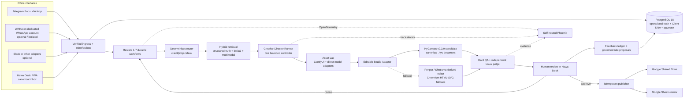

# 00 — Executive Verdict

## The system to build

Hawa Creative OS is a private-office creative operating system that listens through replaceable adapters, converts a request into a validated design brief, retrieves client-specific truth and references, creates an editable design, performs deterministic and visual QA, pauses for human review, publishes approved files, and turns corrections into governed memory.

It is intentionally **not** a generic marketing SaaS, chat bot, Canva clone, or agent swarm.

## The decisive insight

A graphic is not complete when a model returns a beautiful bitmap. It is complete when:

- every required word is exact and editable;
- the logo is the approved asset rather than a generated imitation;
- Sorani, Arabic, English, numbers, and URLs render correctly together;
- dimensions and delivery variants are correct;
- a designer can move, replace, recolor, or rewrite one element without regenerating the whole image;
- the request, reasoning evidence, revisions, approval, and files remain traceable;
- failure at any network boundary can be resumed without duplicate work.

## Final system

## What makes it distinctive

The moat is not image generation. Models will change constantly. The proprietary system is the combination of:

- deterministic multi-client routing;
- Client DNA with approved and rejected creative history;
- editable multilingual reconstruction;
- evidence-backed QA;
- durable office operations;
- governed preference learning;
- a model and editor tournament that prevents dependency stagnation.

## First implementation slice

The first live slice supports one designated Telegram group and Hawa Desk, three clients, one square-post format, one story format, exact copy, approved logos, editable `.hyc`, human approval, Drive publication, and Sheet mirroring. It must survive restart, duplicate webhook, provider outage, and revision tests before expanding.
