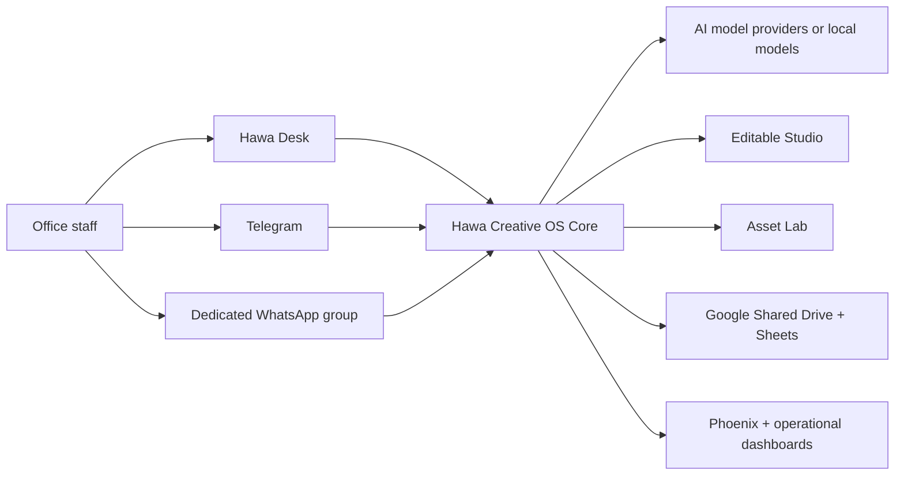
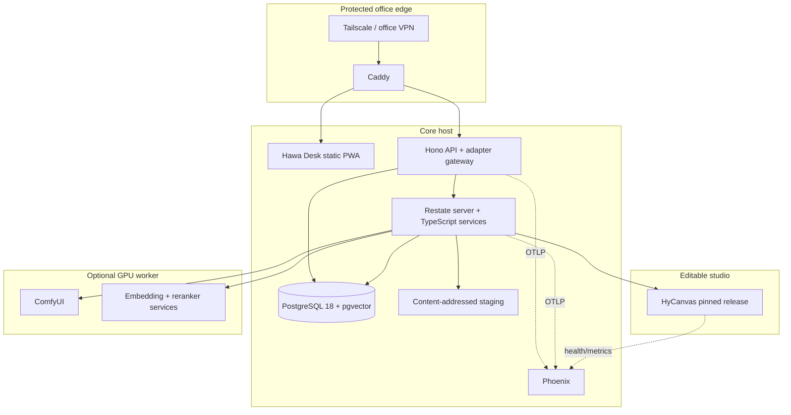

# System Architecture

## 1. Architectural style

Hawa Creative OS is a **private modular monolith with durable workflows and isolated workers**.

It deliberately avoids both extremes:

- not a single no-code automation graph that becomes impossible to test;
- not dozens of microservices that a small office cannot operate.

The core application owns business state and contracts. Restate owns execution journals. PostgreSQL owns durable truth. The editable studio and GPU asset worker are separate processes because they have independent failure and upgrade profiles.

## 2. Context diagram



## 3. Container view



## 4. Component responsibilities

### Hawa Desk

- canonical task inbox;
- task creation and promotion;
- routing explanations and corrections;
- brief review;
- embedded editable-studio launch;
- revision comparison;
- approval/rejection;
- Client DNA administration;
- model/evaluation operations;
- incident-safe replay controls.

### API/adapter gateway

- authenticate users and inbound adapters;
- normalize events into `MessageEnvelope`;
- persist before acknowledgement where platform timing allows;
- assign idempotency keys;
- write transactional outbox commands;
- expose internal OpenAPI endpoints;
- never contain long-running workflow logic.

### Restate services

- task state machine;
- deterministic client/project resolution sequence;
- brief and design-plan workflows;
- retrieval invocation;
- asset-generation scheduling;
- studio operations;
- QA/repair cycles;
- human waitpoints;
- publication/reconciliation;
- governed feedback processing.

### PostgreSQL

- users, roles, clients, projects, mappings;
- messages, tasks, events, state projections;
- Client DNA and rule versions;
- asset/document metadata;
- retrieval chunks and vectors;
- model registry and invocations;
- design/source/revision metadata;
- QA, approvals, publication, feedback, audit;
- inbox/outbox and idempotency.

### Editable Studio

- create and open editable design documents;
- apply exact node-level operations;
- render previews and standard exports;
- preserve font, text, image, vector, layout, and document metadata;
- round-trip source without flattening;
- expose a versioned adapter contract.

### Asset Lab

- execute approved ComfyUI graphs;
- call local/remote image models;
- generate, edit, cut out, upscale, vectorize, and normalize assets;
- return content-addressed outputs and complete provenance;
- receive no database credentials.

### Phoenix

- receive OpenTelemetry traces;
- compare prompts/models/datasets;
- store evaluation evidence;
- expose cost/latency/failure analysis;
- remain advisory to the business state machine.

## 5. State-machine overview

```text
RECEIVED
→ PROMOTION_PENDING (passive message only)
→ ROUTING
→ ROUTING_REVIEW (when ambiguous)
→ BRIEF_DRAFT
→ BRIEF_REVIEW (when facts/copy are missing)
→ CONTEXT_READY
→ DESIGN_PLANNING
→ ASSET_PRODUCTION
→ STUDIO_COMPOSITION
→ QA
→ AUTO_REPAIR (maximum two cycles)
→ HUMAN_REVIEW
→ REVISION_REQUESTED → DESIGN_PLANNING or STUDIO_COMPOSITION
→ APPROVED
→ PUBLISHING
→ COMPLETE

Any active state may enter:
PAUSED | FAILED_RETRYABLE | FAILED_OPERATOR | CANCELLED
```

Only the Restate workflow service may perform business-state transitions. UI and adapters submit commands.

## 6. Reliability boundaries

1. **Ingress boundary:** platform event is normalized and stored with a uniqueness constraint.
2. **Workflow boundary:** outbox command starts or signals a durable workflow.
3. **Model boundary:** invocation has a stable request hash, exact model version, timeout, budget, and schema.
4. **Studio boundary:** each operation carries expected document revision and idempotency token.
5. **Publication boundary:** each artifact identity is derived from task/revision/output/content hash.
6. **Human boundary:** approval references an immutable design revision and QC report hash.

## 7. Failure behavior

| Failure | Required behavior |
|---|---|
| Chat adapter unavailable | Hawa Desk remains usable; adapter health shows stale; later reconciliation imports missed events |
| API process restart | Stored events remain; outbox dispatcher resumes |
| Workflow worker restart | Restate resumes from journal without replaying completed durable calls |
| Model timeout | bounded retry/fallback/human route; completed assets preserved |
| Studio crash | reopen pinned source revision; no approval or publication lost |
| GPU unavailable | queue, remote-provider fallback if policy allows, or manual asset route |
| Drive unavailable | task remains approved/publishing; retry with same publication identity |
| Sheet unavailable | Drive publication may complete; Sheet mirror reconciles later |
| Phoenix unavailable | production continues; trace exporter buffers/drops according to policy and alerts |
| Database unavailable | ingress fails closed or uses platform retry; no fabricated acknowledgement of persistence |

## 8. Dependency direction

```text
domain contracts
  ↑
application services
  ↑
adapters: message / models / retrieval / studio / assets / publisher
  ↑
framework and provider SDKs
```

Domain code must not import Telegram, WAHA, Google, HyCanvas, ComfyUI, or model-provider SDK types.

## 9. Versioning

- API: semantic version plus OpenAPI compatibility checks.
- events: explicit `event_type` and `schema_version`.
- editable document: pinned HyCanvas schema version plus migration copy.
- Client DNA: immutable numbered version.
- prompts: content hash and semantic version.
- models: exact provider model ID/snapshot and parameter profile.
- ComfyUI: graph hash, node package lock, model checksums.
- deployments: image digests and Git commit.

## 10. Architecture fitness functions

CI and nightly tests shall fail when:

- a core package imports a provider SDK directly;
- an event schema changes without version increment;
- a design lacks editable source;
- retrieval lacks a client filter;
- publication lacks an idempotency key;
- a model alias is used without resolving to an exact version;
- a ComfyUI workflow references an unapproved node/model;
- a critical RTL golden render changes unexpectedly;
- migration down/restore tests fail;
- a requirement has no acceptance/test mapping.
