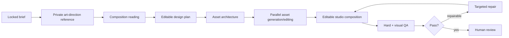
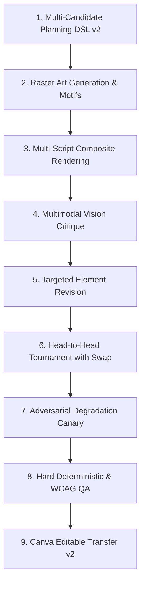

# Creative Engine Design

## 1. Goal

Produce work that is genuinely art-directed and flexible while preserving exact facts, client identity, editability, and operational reliability.

The engine is neither a flat image generator nor a template filler. It chooses the least restrictive safe production topology for each brief.

## 2. Creative stages



## 3. Private art-direction reference

For novel or quality-sensitive work, a high-capability image model may create one or more visual references showing hierarchy, crop, rhythm, lighting, materiality, and composition.

Rules:

- references live under `reference/`, never under shipping assets;
- their pixels never enter final output;
- generated text is ignored except as optional non-factual copy inspiration;
- facts, names, prices, dates, contact information, legal text, and logos may come only from locked brief/Client DNA;
- a logo-bearing Studio render requires the task's explicit, decoded client logo bytes; an absent or invalid logo fails the render rather than borrowing a packaged brand asset (ADR-047);
- text-free art prompts and procedural fallbacks take their colors and visual concept from the admitted client layout; a generic art path must not impose one house client's navy, gold, or institutional style;
- procedural motif generation refuses an absent or invalid client palette, including in provider-failure fallbacks;
- the production image-art provider checks the palette before any model call and does not substitute house colors or a house visual style in its prompt;
- the reference model is encouraged to be visually ambitious rather than safe and generic;
- every reference prompt and output hash is retained in the design replay.

## 4. Production topologies

The Creative Director selects one topology or a deliberate combination.

| Topology | Best for | Editable ownership |
|---|---|---|
| **Structured template** | recurring cards, quote tiles, sponsor posts | studio nodes and template constraints |
| **Code-native field** | typographic, editorial, geometric, data-led posters | live text, vectors, paths, patterns, charts |
| **Slot matrix** | product grids, speakers, episodes, comparisons | one independent asset per semantic slot |
| **Continuous scene** | shared lighting/perspective/atmosphere | generated background plus live type/brand nodes |
| **Cutout stack** | people/products/stickers with overlaps | independent transparent assets and depth order |
| **Layered collage** | editorial, cultural, scrapbook, mixed media | independent fragments, textures, masks, live copy |
| **Human-led canvas** | unusually subtle, sensitive, or experimental work | designer starts/refines in the same editable studio |

No topology is the default. The brief and visual idea decide.

## 5. DesignPlan contract

The model must output a validated `DesignPlan`, including:

- exact source brief and language direction;
- chosen topology and rationale;
- artboard variants;
- text hierarchy and locked strings;
- required official assets by ID;
- generated asset slots, dimensions, prompts, references, dependencies, and layer order;
- code-native geometry/vector instructions;
- template or style-family references;
- brand rules applied;
- visual risks and QA checks;
- source-package requirements;
- human-review level.

The model cannot directly execute arbitrary code or choose credentials/destinations.

## 6. Asset routing

Asset order of preference:

1. exact approved client asset;
2. approved previous reusable asset;
3. office-owned or licensed stock/source material;
4. non-destructive edit of an approved/source image;
5. new generated asset;
6. human-created asset.

The Asset Router chooses by task and policy, not one default provider.

### Provisional model pool

- GPT-Image-2 snapshot for robust generation/editing and image-reference work;
- Gemini 3 Pro Image for difficult compositing and reference-rich alternatives;
- FLUX.2 max/pro/flex for controllable generation and provider diversity;
- FLUX.2 Klein 4B for local/private low-latency generation on suitable GPU;
- Recraft V4.1 Vector for vector-first graphic assets;
- specialist background removal, upscaling, face/detail restoration, or vectorization nodes only after evaluation.

Every route is selected through the model/workflow registry and can be replaced.

## 7. ComfyUI execution policy

ComfyUI is used because it can express visual pipelines as reproducible graphs. It is not allowed to become an uncontrolled plugin environment.

Required controls:

- separate worker account/container;
- no office database or Google credentials;
- outbound network denied by default;
- allowlisted custom nodes only;
- node source commit/digest locked;
- model weights checksummed;
- workflow JSON versioned and schema-checked;
- maximum VRAM/RAM/runtime/output limits;
- input MIME and dimension limits;
- output malware/content checks;
- complete graph/model/seed/provenance manifest;
- one-click quarantine of a workflow or node package.

## 8. Creative diversity without chaos

Routine work generates one candidate by default. Novel work may generate 2–3 meaningfully different directions when the brief justifies exploration.

Diversity is created by varying an explicit axis:

- visual metaphor;
- typography dominance;
- photographic vs graphic material;
- grid tension;
- crop/scale;
- cultural texture;
- color strategy;
- information density.

The system must not make four near-duplicates merely to appear creative.

## 9. Targeted repair

A failed design is not regenerated wholesale unless the composition itself is wrong.

Examples:

- wrong crop → update crop/focal point;
- weak image → replace only that asset;
- overflow → adjust text box/type scale or return for copy decision;
- logo rule → replace/reposition official logo node;
- hierarchy → modify relevant node styles/geometry;
- spelling → replace exact text node;
- background conflict → edit background asset or add controlled overlay.

Maximum automatic repair cycles: **two**. Further cycles require a human because repeated autonomous repair often degrades design coherency and wastes cost.

## 10. Human creative control

The reviewer can:

- edit any node directly;
- lock nodes from AI modification;
- select one direction;
- ask for a scoped revision in natural language;
- compare before/after;
- promote a composition to a reusable style family or template;
- mark a change as one-time or proposed permanent preference.

Manual edits are first-class evidence. The system computes a structured diff rather than treating the final file as opaque.

## 11. Design replay

Each revision retains:

```text
request + attachments
routing evidence
locked brief
Client DNA version
retrieved references
art-direction prompt/reference
DesignPlan
asset graph/prompts/seeds/models/hashes
editable document before/after operations
rendered previews
QC findings and repairs
human edits/comments
approval
published artifacts
```

Replay is evidence and reproducibility—not a promise that stochastic model outputs can be regenerated pixel-identically.

## 12. Quality principle

The creative engine is permitted to be adventurous in composition and imagery. It is never permitted to be adventurous with facts, exact copy, client identity, logos, permissions, destinations, or approval state.

## 13. Design Studio v2 Addendum: The `see → judge → revise` Loop

Design Studio v2 (ADR-029) elevates the creative engine from a single-shot layout generator to a multi-stage iterative visual synthesis loop:



### Invariants Preserved
1. **Fact & Copy Immutability**: Text copy is placed strictly by index from the locked brief. Models never rewrite, summarize, or translate factual copy during design synthesis.
2. **Text-Free Raster Art**: Generative background art (`gemini-3-pro-image`, Nano Banana Pro) is strictly conditioned to contain no letters, numbers, emblems, flags, or human faces/persons. Synthetic imagery is validated for brand color alignment ($\Delta E2000 \le 12.0$) and watermarked with SynthID.
3. **Contrast Scrims**: Backgrounds automatically receive dynamic scrims evaluated by `composite-contrast.ts` ensuring all text boxes meet WCAG 2.2 contrast requirements against the composite bitmap.
4. **Position Bias Cancellation**: The vision judge evaluates candidates in pairwise matches where presentation order (Left vs Right) is systematically swapped; contradictory verdicts result in a tie rather than false confidence.
5. **Adversarial Canary**: Every winning candidate must beat a deliberately degraded twin (40% font shrinkage or logo overlap). If the vision judge fails this check, `judgeStatus` becomes `UNRELIABLE` and selection falls back to objective layout metrics.
