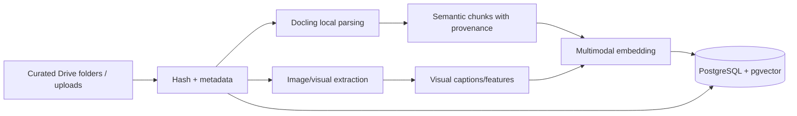

# Client DNA and Retrieval Design

## 1. Purpose

Memory must answer two different questions:

1. **What is true and allowed?** — authoritative Client DNA.
2. **What previous work is contextually useful?** — retrieval memory.

Conflating these into one vector search produces plausible but dangerous results.

## 2. Client DNA

Client DNA is a versioned, human-governed structured object containing:

- identity, aliases, legal names, products, campaigns;
- approved/deprecated logos and exact usage rules;
- colors, fonts, grids, spacing, clear zones;
- language, spelling, terminology, numerals, punctuation, tone;
- imagery preferences/prohibitions;
- approved templates/style families;
- recurring deliverables and dimensions;
- required/disallowed claims and notices;
- approval chain and sensitivity classes;
- Drive/Sheet/project mappings;
- model-egress and retention policy;
- explicit client preferences and scoped learned rules.

A rule is never overwritten. A new version supersedes it with author, reason, evidence, and effective dates.

## 3. Retrieval corpus

Eligible sources:

- approved brand guideline documents;
- approved logos/assets;
- approved final designs and editable sources;
- approved briefs/copy;
- explicit feedback and activated rules;
- campaign notes and client communications marked for memory;
- rejected designs stored only in negative memory.

Do not index the entire Drive indiscriminately.

## 4. Ingestion pipeline

Requirements:

- source Drive/file/version/hash preserved;
- page/slide/artboard/region provenance preserved;
- tables and layout relationships retained when useful;
- exact strings and asset IDs stored separately from embeddings;
- unchanged files are not reprocessed;
- deleted/superseded sources become inactive, not silently lost;
- embeddings include model/version/dimension.

### Uploaded asset source retention (ADR218)

Generic `/v1/assets/upload` requires actual content, a currently writable active
client, measured size, media verification and bounded decoding. The admitted hash
identifies verified stored bytes, including sanitized SVG derivatives. Distinct
originals have separate append-only source receipts; both original and admitted
files are foreign-keyed garbage-collection and backup roots. Retrying the same
client/content reconciles identity without replacing first asset metadata.
Historical metadata-only rows remain unavailable until genuine bytes are supplied.
Scoped downloads verify actual bytes and never grant access from a hash alone.
Uploading a font does not install it or activate Client DNA.

## 5. Hybrid retrieval

Retrieval sequence:

1. establish tenant/client/project authorization;
2. load active authoritative Client DNA directly;
3. derive task type, language, platform, campaign, and retrieval intents;
4. exact lookup for identifiers, official assets, templates, names, prices, dates;
5. PostgreSQL trigram/full-text search over normalized and original text;
6. multimodal vector search within the already-filtered client corpus;
7. merge candidates with reciprocal-rank or evaluated weighted fusion;
8. rerank with a multimodal reranker;
9. exclude deprecated, rejected-positive, or incompatible records;
10. build a small evidence pack with IDs and excerpts/previews.

## 6. Security invariant

The vector query must include tenant/client filters in the database operation. It is prohibited to retrieve globally and ask a model to discard other clients.

A request may access multiple clients only through a privileged explicit comparative workflow with audit and no generative publication side effect.

## 7. Sorani/Arabic search normalization

Store original text unchanged plus a search-normalized field.

Normalization may include:

- Unicode NFC/NFKC policy defined per field;
- Arabic/Kurdish character variant mapping for search only;
- removal/normalization of tatweel and selected diacritics for search;
- whitespace and punctuation normalization;
- numeral variants;
- language tags and script direction;
- char-trigram indexes to avoid dependence on English stemming.

Never use normalized text as final copy.

## 8. Positive and negative memory

### Positive

Only explicitly approved designs/examples can receive positive retrieval weight.

### Negative

Rejected or corrected work stores:

- rejection category;
- affected nodes/features;
- scope;
- reviewer;
- whether the issue is factual, brand, visual, or preference;
- linked corrected version.

Negative examples can add `avoid` evidence but may never appear as approved inspiration.

## 9. Initial local models

Initial candidates:

- Qwen3-VL-Embedding-2B;
- Qwen3-VL-Reranker-2B;
- 8B variants on larger GPU;
- current challengers admitted through the retrieval evaluation.

The 2B path is selected for the first proof because it is easier to host and lets the office evaluate real data before buying larger hardware.

## 10. Retrieval context budget

The Design Context Pack normally contains:

- active Client DNA digest;
- exact required assets/templates;
- 3–6 approved visual examples;
- 2–5 highly relevant feedback/rule items;
- current campaign/project facts;
- source citations and confidence.

More context is not automatically better. Irrelevant examples create brand drift.

## 11. Evaluation and monitoring

Track by client/task/language:

- exact asset/rule hit rate;
- nDCG@10 and Recall@10;
- human usefulness rating;
- stale/superseded retrieval rate;
- negative-example contamination;
- context size/latency;
- cross-client leakage;
- downstream approval/revision correlation.

## 12. Deletion and retention

Deleting source material triggers:

- immediate authorization exclusion;
- tombstone/version record;
- scheduled removal of embeddings/previews according to retention policy;
- preservation of audit and artifact integrity where legally/operationally required;
- regeneration of affected context packs only when needed.

## 13. Current Studio exemplar baseline (ADR-115)

The packaged approved-reference selector uses Unicode lexical BM25 with separate
format/curator fallback. It is not the multimodal hybrid retrieval admission in
section 5. It preserves original copy, filters approval and actual image availability/
hashes before scoring, and records algorithm, manifest hash, matched terms, selected
IDs and exclusions. That evidence is retained with visual inputs and normal run
stage diagnostics. Existing pinned runs reuse their original selection under current
policy checks. Client authorization remains ahead of packaged collection access.
No disk vector cache or paid retrieval call is used. Missing bilingual metadata,
missing native reference files, multilingual semantic ranking and human usefulness
qualification remain explicit gaps. See [ADR-115](../adrs/115_unicode_exemplar_retrieval.md).
