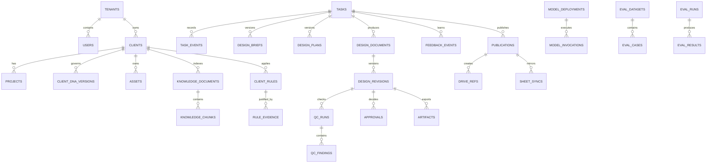

# Database Design

## 1. Database role

PostgreSQL is the authoritative system of record for office operations, Client DNA, retrieval metadata, workflow projections, model evidence, approvals, and publication reconciliation.

Restate owns execution journals; Google Drive owns approved file storage; HyCanvas owns no irreplaceable business truth.

## 2. Logical domains

## 3. Identity and tenancy

Every client-owned or security-sensitive row includes `tenant_id`. Most include `client_id`. IDs use UUIDv7 where the application/runtime supports it, otherwise secure UUIDs with indexed timestamps.

Database session context or explicit RLS-safe functions identify the application user and tenant. Service workers use scoped application identities, not unrestricted shared credentials where avoidable.

## 4. Append-only records

The following are append-only except for controlled redaction/tombstoning:

- message events and revisions;
- task events;
- model invocations;
- design revisions;
- QA runs/findings;
- approvals;
- feedback events;
- Client DNA/rule versions;
- audit events;
- publication attempts.

Current state is a projection/reference, not a destructive replacement of history.

## 5. Client DNA tables

- `client_dna_versions`: immutable version envelope and digest.
- `client_rules`: typed, scoped, effective-dated rules.
- `rule_evidence`: corrections, approvals, documents, and explicit instructions supporting a rule.
- `brand_assets`: official asset identity, hash, variant, status, and usage restrictions.
- `templates`: studio/source template and compatibility metadata.
- `glossary_terms`: language-specific approved/prohibited terms and normalization aliases.

## 6. Retrieval tables

`knowledge_documents` stores source identity/version/hash/status. `knowledge_chunks` stores original text, normalized search text, provenance, metadata, and embedding linkage.

Embeddings should be versioned by model and dimension. Do not force all future models into one fixed vector column without a migration plan. The initial schema uses a practical vector column plus model metadata; a later partition/table may support additional dimensions.

Indexes:

- B-tree on tenant/client/project/status/source IDs;
- GIN for full-text JSONB/tsvector where useful;
- trigram GIN/GiST on normalized text;
- vector HNSW only after exact filtered search is measured insufficient;
- partial indexes for active/approved records;
- uniqueness constraints for source versions and idempotency.

## 7. Tasks and events

`tasks` is a current projection with state, priority, owner, client/project, current brief/plan/design revision, workflow ID, deadlines, and policy flags.

`task_events` is the immutable transition ledger. A database trigger prevents invalid direct state mutation unless accompanied by an authorized transition function or application transaction.

## 8. Model registry

- `model_roles`: stable semantic roles.
- `model_deployments`: exact provider/model/snapshot/config and admission status.
- `prompt_versions`: immutable prompt/tool/schema hashes.
- `model_invocations`: request/input/output hashes, cost, latency, result, error, trace.
- `model_budget_usage`: daily/monthly scoped counters.

Sensitive prompt/response content may be encrypted, redacted, or omitted according to client retention policy while preserving hashes and metrics.

## 9. Editable designs

- `design_documents`: stable logical document for a task/direction.
- `design_revisions`: source object key/path, source hash, neutral manifest, parent revision, studio version/schema, author, status.
- `design_operations`: optional node-level command/diff evidence.
- `artifacts`: exported files with hashes, dimensions, MIME, provenance.

A unique constraint prevents two different source byte streams from claiming the same revision identity.

## 10. Publication

`publications` models saga state. `drive_refs` and `sheet_syncs` record external IDs, expected hashes, attempts, and reconciliation status. No completion state is inferred solely from the existence of a URL.

## 11. Inbox/outbox

- `inbox_events`: unique normalized inbound event identity and processing status.
- `outbox_commands`: command type, aggregate ID, payload, attempt/lease state.
- dispatcher uses `FOR UPDATE SKIP LOCKED` or equivalent safe leasing;
- rows are retained/audited, then compacted according to policy.

## 12. Constraints

Examples:

- approved revision must have successful critical QC;
- publication requires an approval matching the same revision/QC hash;
- positive visual example requires approved state;
- rejected examples cannot be positive;
- active Client DNA version unique per client/effective interval;
- source event unique per adapter/account/source event ID;
- Sheet task ID unique per reporting sheet;
- Drive artifact identity unique per publication/variant/kind/hash.

## 13. Partitioning and retention

At office scale, premature partitioning is unnecessary. Candidate future partitions:

- `message_events` by month;
- `model_invocations` by month;
- `audit_events` by quarter;
- `knowledge_chunks` by tenant/client only if measured.

Use policy-driven purge jobs with tombstones and backup-retention awareness.

## 14. Backup

- continuous WAL archive/PITR;
- daily full/incremental policy through pgBackRest;
- schema/config export;
- separate restic backup of staging, manifests, prompts, workflows, and deployment configuration;
- encrypted off-site copy;
- scheduled restore to a clean host and data-integrity verification.

The executable schema is in `db/schema.sql`; RLS policies are in `db/rls.sql`.
