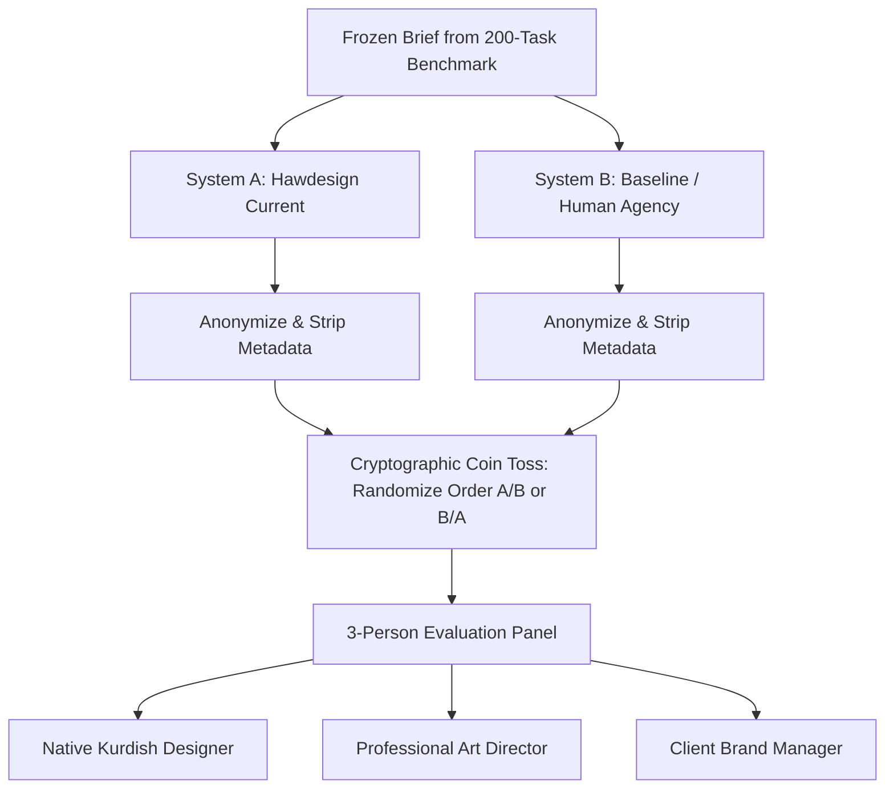

# Hawdesign Creative Advantage Benchmark Protocol (Gate D & W07)

**Document Version:** 1.0.0  
**Effective Date:** 20 September 2026  
**Normative References:** `MASTER_SPEC.md`, `AGENTS.md`, ADR-030 (Model Policy), Gate D (Creative Quality), Gate E (Brand & Typography), [Zheng et al., arXiv:2306.05685](https://arxiv.org/abs/2306.05685), [Graphic-Design-Bench, arXiv:2604.04192](https://arxiv.org/abs/2604.04192).

---

## 1. Executive Summary & Purpose

Hawdesign does not declare creative superiority through model self-grading or synthetic pass/fail loops. Research on LLM judges ([Zheng et al., 2023](https://arxiv.org/abs/2306.05685)) demonstrates severe vulnerabilities in model-based evaluation:
1. **Position Bias:** Models overwhelmingly favor the first response presented in pair comparisons.
2. **Verbosity & Surface Bias:** Models favor longer, ornate descriptions over succinct, disciplined typography.
3. **Self-Enhancement Bias:** Model families systematically prefer outputs generated by their own family or similar architectures.
4. **Lack of Perceptual Typography Awareness:** Models without calibrated visual-spatial grounds cannot detect diacritic clipping in Kurdish Sorani (ڕ, ڵ, ێ, ۆ) or subtle margin collisions.

This protocol establishes the normative, frozen evaluation methodology required for **Task W07** and **Gate D** qualification. It mandates a held-out 200-task benchmark, randomized blind human comparisons against professional baselines, and rigorous statistical calibration.

---

## 2. Held-Out 200-Task Benchmark Specification

The normative evaluation dataset is frozen in `evals/routing_brief.jsonl`. It is strictly held out from agent prompt tuning, exemplar few-shot pools, and training sets.

### 2.1 Dataset Composition & Stratification

| Stratum | Language | Count | Primary Clients | Purpose |
|---|---|---|---|---|
| **S1: Kurdish Sorani Core** | `ckb` | 53 | ASTER, NOVA, RONA, DRUSTEE, SEBAR | Ascender/descender clearance, UAX #9 bidi, local cultural idioms, exact Sorani orthography |
| **S2: Arabic Regional** | `ar` | 49 | ASTER, NOVA, RONA, ERBIL_EXPRESS | Formal modern standard Arabic, Arabic numerals, regional typography |
| **S3: English International** | `en` | 53 | ASTER, NOVA, RONA | Latin typography, grid discipline, high-contrast layouts |
| **S4: Mixed-Script Bidi** | `mixed` | 45 | All clients | Mixed Latin brands (e.g. "NOVA ONE") + Sorani copy + phone numbers (+964) + prices (IQD) |
| **Total** | — | **200** | — | **Representative commercial office distribution** |

### 2.2 Client Distribution & Abstention Cases

- **ASTER (Hospitality / Luxury):** 43 tasks
- **NOVA (Tech / Consumer Electronics):** 42 tasks
- **RONA (Healthcare / Clinical):** 41 tasks
- **DRUSTEE (Pharmacy / Medical):** 23 tasks
- **SEBAR (Logistics):** 23 tasks
- **ERBIL_EXPRESS (Food & Delivery):** 23 tasks
- **Adversarial / Abstention (Unpermitted / Cross-Client / Missing Info):** 5 tasks (`expected.must_abstain: true`)

### 2.3 Graphic-Design-Bench (GDB) Complementary Tasks

Aligned with [Graphic-Design-Bench (April 2026)](https://arxiv.org/abs/2604.04192), every task in the benchmark is tagged and evaluated across five structural design axes:
1. **Perceptual Grouping:** Proximity and gestalt grouping of related elements (e.g., price + currency + CTA).
2. **Visual Hierarchy:** Distinct visual scale ratios (Title: 32–48pt, Subtitle: 20–28pt, Body: 14–18pt).
3. **Typography & Diacritic Safety:** Mandatory lineHeight >= 1.38 and >= 4px vertical padding for Kurdish Sorani high ascenders (ڵ, ۆ, ێ) and low descenders (ڕ).
4. **Layout Balance & Safe Zones:** Strict enforcement of social safe margins (Meta Feed 4% margin, Instagram Story 14% top / 20% bottom exclusion zones).
5. **Brand Kit Fidelity:** Hex color accuracy within brand palette, vector logo aspect ratio preservation.

---

## 3. Blind Comparison Protocol

Creative advantage cannot be claimed against a weak strawman. Hawdesign is benchmarked against two comparison classes:
1. **Baseline 1:** The previous audited release of Hawdesign (audit baseline `9c22026f444c81494d286354960a0b10efaa1176`).
2. **Baseline 2:** Professional human agency baselines (production Canva templates crafted by senior graphic designers for the same client brief).

### 3.1 Triple-Blind Execution Procedure

1. **Generation:** Both systems produce designs from the identical brief and brand kit with no operator intervention.
2. **Anonymization:** All watermarks, metadata, tool logs, and file headers are removed. Previews are rendered at identical dimensions and resolutions (1080×1080 or 1080×1350, 300 DPI PNG).
3. **Randomized Pair Assignment:** A cryptographic random generator assigns outputs to Slot 1 and Slot 2. A mirrored swap test (Slot 2 vs Slot 1) is recorded for judge consistency.
4. **Independent Human Panel:**
   - Evaluator 1: Native Kurdish speaker with graphic design background.
   - Evaluator 2: Senior Art Director (language-agnostic design principles).
   - Evaluator 3: Client Representative (brand fit and factual compliance).

### 3.2 Evaluation Rubric & Scoring

Evaluators score each pair on 5 dimensions using a 5-point Likert scale, followed by a forced-choice verdict (**Win System A**, **Tie**, **Win System B**):

| Dimension | Weight | Criteria | Hard Failure Condition |
|---|---|---|---|
| **Factual Accuracy** | 30% | Exact copy match, phone, price, dates, no hallucinated claims | Any changed price, phone, or date = Immediate Disqualification |
| **Typography & RTL** | 25% | Sorani orthography, ascender clearance, proper bidi order | Diacritic clipping, inverted numbers, Arabic ك in Sorani copy |
| **Brand Adherence** | 20% | Color palette, logo placement, visual tone | Wrong client logo, unapproved accent colors |
| **Visual Hierarchy** | 15% | Readability, contrast ratio (>= 4.5:1), grid structure | Overlapping text boxes, unreadable text |
| **Editability** | 10% | Live text nodes, Canva layer structure, discrete elements | Flattened bitmap rasterization = Immediate Disqualification |

---

## 4. LLM Judge Calibration & De-biasing

Automated LLM judges are strictly supplementary and **cannot grant Gate D qualification alone**. When automated judges are run for regression screening, they must adhere to the following calibration rules:

### 4.1 De-biasing Architecture

1. **Swap Consistency Enforcement:** Every comparison must be run in both orientations:
   $$\text{Verdict}(A, B) \quad \text{and} \quad \text{Verdict}(B, A)$$
   If $\text{Verdict}(A, B) \neq \text{Verdict}(B, A)^{-1}$, the comparison is flagged as **Inconsistent (Judge Failure)** and excluded from positive scoring while counting against judge reliability.
2. **Chain-of-Thought Rubric Grounding:** The judge must evaluate deterministic facts (exact token presence, diacritic integrity) before rendering an aesthetic opinion.
3. **Self-Enhancement Mitigation (ADR-030 Compliant):** In accordance with ADR-030 (OpenAI-only architecture), the visual judge executes on a distinct evaluation tier (e.g. `gpt-4.1-mini` evaluating `gpt-6-astra` layouts) paired with strict order-swap symmetry (`comparePairWithOrderSwap`) and deterministic metric grounding, preventing generator self-preference without requiring prohibited external multi-provider SDKs.

### 4.2 Human-Judge Concordance Calibration

Before an automated judge's scores can be reported:
- A calibration set of 50 tasks must be evaluated by both the Human Panel and the LLM Judge.
- **Cohen's Kappa ($\kappa$)** between Human Panel consensus and LLM Judge must exceed **0.75** (substantial agreement).
- Swap consistency rate must exceed **95%**.
- If $\kappa < 0.75$, the LLM judge is declared uncalibrated and its verdicts cannot be cited in qualification reports.

---

## 5. Verification Metrics & Minimum Passing Gates

To achieve **Gate D Creative Advantage Qualified** status:
- **Factual Accuracy Escape Rate:** 0.0% (Zero tolerance for hallucinated prices, phone numbers, or dates).
- **Editability Escape Rate:** 0.0% (100% of delivered assets must possess live, discrete text nodes).
- **Native Script Fidelity:** >= 98.0% approval by native Kurdish reviewers.
- **Win Rate vs Baseline 1 (Previous Audited Version):** >= 65.0% win rate with statistical significance ($p < 0.01$).
- **Win Rate vs Baseline 2 (Human Agency):** >= 45.0% win rate and >= 35.0% tie rate (non-inferiority to professional baseline).
- **Operator Edit Time:** Median manual fix time in Canva < 3.0 minutes per accepted creative.

---

## 6. Prohibited Practices

1. **No AI-Generated Human Ratings:** Fabricating human panel scores or having an agent fill in reviewer attestations is a catastrophic qualification failure.
2. **No Selective Sampling:** Cherry-picking 5 attractive designs out of 200 is forbidden. All 200 tasks must be reported with their complete unedited receipts and hashes.
3. **No Uncalibrated Score Averaging:** High visual scores cannot compensate for factual errors, clipped Kurdish letters, or flattened raster copy.
