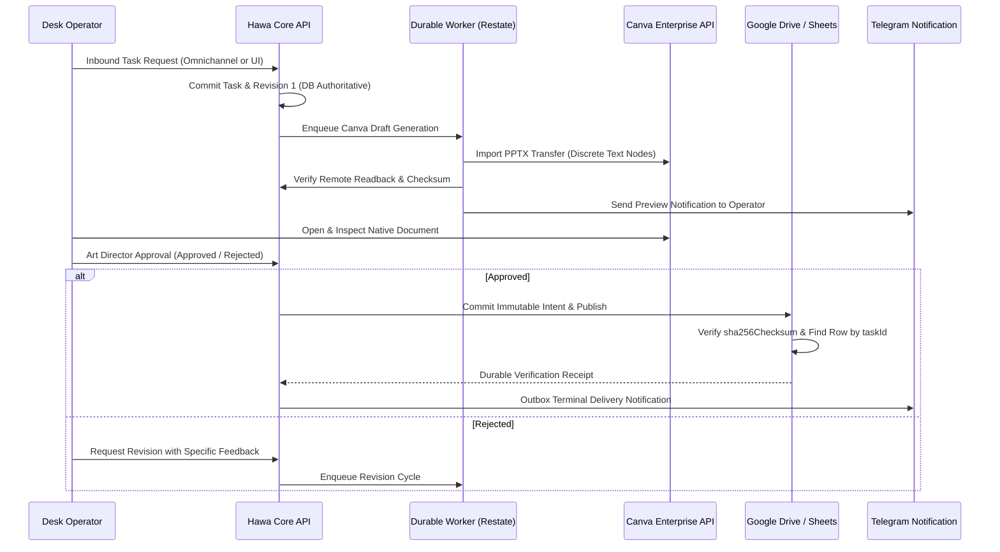

# Hawdesign Production Acceptance Pilot Contract (W08 & Final Admission)

**Contract Version:** 1.0.0  
**Effective Date:** 20 September 2026  
**Audited Release Target:** `9c22026f444c81494d286354960a0b10efaa1176` (or subsequent verified release)  
**Normative References:** `MASTER_SPEC.md`, `AGENTS.md`, NFR-021 (Usability & Accessibility), Gates A–H, [Google SRE: Implementing SLOs](https://sre.google/workbook/implementing-slos/).

---

## 1. Scope, Purpose & Bound

This pilot contract governs the operational trial required to earn production admission for Hawdesign.

### Strict Governance Rules
1. **No Simulated Data in Production Accounting:** Simulated, synthetic, or agent-generated tasks cannot count toward the 100 pilot tasks.
2. **Real Client Participation:** The pilot must be executed across three verified institutional clients:
   - **Client 1: KAAE (Education / Quality Assurance)** — Academic cards, standards publications, formal institutional announcements.
   - **Client 2: Drustee (Healthcare & Evidence-Based Pharmacy)** — Health awareness campaigns, medication instructions, medical advisories.
   - **Client 3: Aster (Hospitality & Luxury Resort)** — Seasonal menus, event promotions, guest invitations, social reels.
3. **Task Quota Distribution:** Minimum 100 total real commercial tasks:
   - KAAE: 40 tasks minimum.
   - Drustee: 35 tasks minimum.
   - Aster: 25 tasks minimum.
4. **Denominators are Inviolable:** Every inbound request entered into the pilot queue enters the denominator. Retries, cancellations, manual rescues, and technical errors must remain in the ledger; they cannot be pruned to artificially inflate success percentages.

---

## 2. Operational Lineage & Verification Boundary

Every pilot task must follow the verified vertical lifecycle:

### Mandatory Lineage Ledger Entries
For each task $i \in [1, 100]$, the pilot ledger must record:
1. `taskId` (UUID v4) and `tenantId`.
2. Exact source brief text, client ID, and timestamp.
3. Model and gateway transaction receipts (tokens, cost in USD, latency).
4. Generated PPTX hash, remote Canva design ID, and preview URL.
5. Deterministic QA report (bidi check, diacritic clearance, margin safety).
6. Human Art Director decision (Timestamp, Operator ID, Verdict, Comments).
7. Operator editing time (measured minutes between initial Canva open and final approval).
8. Drive file ID, Sheets row number, and verified remote `sha256Checksum`.
9. Outbox command status and Telegram delivery receipt ID.

---

## 3. Key Performance Indicators & Passing Thresholds

| KPI | Target | Measurement Method | Blocker Condition |
|---|---|---|---|
| **Autonomous Success Rate** | >= 95.0% | Complete delivery without engineering rescue | < 95.0% requires root-cause analysis and pilot reset |
| **Critical Isolation Escapes** | 0 (Zero) | Cross-client read/write/event leakage | >= 1 escape = Immediate Pilot Abort & Rollback |
| **Factual Accuracy Escapes** | 0 (Zero) | Hallucinated prices, dates, phone numbers | >= 1 escape = Immediate Pilot Abort & Rollback |
| **Editability Escapes** | 0 (Zero) | Flattened bitmap rasterization in Canva | >= 1 escape = Immediate Pilot Abort & Rollback |
| **Kurdish Diacritic Clipping** | 0 (Zero) | Clipped ascenders (ێ, ڵ, ۆ) or descenders (ڕ) | >= 1 escape = Immediate Pilot Abort & Rollback |
| **Median Operator Edit Time** | <= 3.0 min | Stopwatch from Canva open to approve | > 5.0 min = Ergonomic failure |
| **Average Task AI Cost** | <= $0.05 | Aggregated model gateway cost / task | > $0.15 = Economic failure |
| **Observed Uptime During Pilot** | >= 99.5% | Good events / all eligible events | < 99.0% breaches operational SLO |

---

## 4. Operator Usability & Accessibility (NFR-021 & Gate F)

The pilot requires testing desktop and mobile operator journeys without using a command line terminal.

### 4.1 Required Operator Journeys
1. **Intake & Creation:** Operator enters task via Web UI or Telegram message; task renders in list within 1.5 seconds.
2. **Review & Previews:** Operator views rendered SVG/PNG preview with zoom, color inspection, and copy inspection.
3. **Canva Native Hand-off:** One-click open into Canva editor; layers, typography, and text boxes immediately selectable and editable.
4. **Correction & Re-run:** Operator can edit copy in Canva or request AI revision with natural language feedback.
5. **Approval & Publication:** Single-click approval commits immutable intent and dispatches Drive/Sheets/Telegram pipeline.

### 4.2 Accessibility Verification
- Keyboard Navigation: Tab index order traverses all interactive controls logically without trap.
- Focus States: Visible, high-contrast focus rings on all inputs and action buttons.
- Screen-Reader Labeling: Semantic HTML (`<main>`, `<nav>`, `<button>`, `<dialog>`), valid `aria-label` and `aria-live` on task queues and status badges.
- Color Contrast: WCAG 2.1 AA compliant (minimum 4.5:1 for normal text, 3:1 for large text and UI components).

---

## 5. Rollback & Circuit Breaker Triggers

The pilot must automatically halt and trigger rollback procedures upon any of the following events:
1. **Security Isolation Breach:** Any cross-tenant data leak, role escalation, or unauthorized client access.
2. **Data Integrity Failure:** Any Google Sheet row overwrite, corrupt Drive file marked as verified, or missing outbox notification.
3. **Excessive Defect Rate:** Two consecutive tasks with critical factual errors (hallucinated claims or incorrect pricing).
4. **Cost Runaway:** Single task exceeding $0.50 USD or daily spend exceeding client budget cap ($10.00 USD/day).
5. **Crash Loop:** Core API or Worker restarting more than 2 times in a 24-hour period.

---

## 6. Pilot Signoff & Acceptance Authority

**Task W08 cannot be marked complete by an automated script or AI agent.**

Formal acceptance requires manual signoff by:
- **Operations Lead / System Owner:** Attesting to uptime, cost accounting, and zero infrastructure incidents.
- **Lead Art Director:** Attesting to visual quality, typography safety, and operator ergonomics.
- **Client Representatives (KAAE, Drustee, Aster):** Attesting to delivery timeliness and brand satisfaction.

Until all 100 tasks are delivered and signed off, Task W08 remains **OPEN / IN PROGRESS**.
