# Hawdesign: independent product and reliability audit

**9 September 2026 · examined commit `f597bffbf8af3fb1bc65f1028dc161f095ab9ccf` · local running product at port 8080**

**Verdict: 2/10 for dependable production use against a world-class standard.** There is meaningful editor and interface work here, but several of the most important guarantees are simulated. The application can announce approval, publication, integration health, and perfect model scores without establishing the underlying facts. That is the main quality problem. More features would make it harder to solve.

This is a judgment of the currently observed implementation, not the ambition, the specification, or the effort invested. The specification has strong principles. The runtime does not yet enforce enough of them. “True 10/10,” “100% compliant,” and “#1” are not defensible descriptions of this build.

## Scorecard

These are expert judgment scores, not statistically measured competitor rankings. Ten means excellent execution of the existing scope, supported by adversarial tests and real user outcomes. No credit is awarded for feature count. Fatal trust failures cap production readiness regardless of attractive screens.

| Dimension | Hawdesign | Why |
|---|---:|---|
| Robustness and security | **2/10** | Fake authentication accepted; unauthenticated approvals; task state lost between processes. Some useful isolated domain checks exist. |
| Visual design | **4/10** | Consistent cards, spacing, sidebar, and readable broad hierarchy. Dense editor chrome, inconsistent icon treatment, technical marketing copy, weak candidate composition. |
| UI/UX | **3/10** | Main routes are discoverable. Review overload, misleading counts, broken modal focus, missing client choice at intake, and ineffective mobile Fit View damage actual use. |
| Intelligence | **2/10** | Useful deterministic building blocks, but routing evaluation rewards any successful response; visual evaluation is not a model review; retrieval scores include constants. Production creative quality is unqualified. |
| Pipeline reliability | **1/10** | Running Restate has no registered services; worker does not execute workflows; publication and reconciliation can manufacture completion. |

The simple weighted diagnostic (25% robustness, 15% design, 20% UX, 15% intelligence, 25% pipeline) is 2.25/10. I report **2/10**, avoiding false precision. This is not a claim that every component is 80% broken; it means the complete system cannot currently be trusted with the advertised responsibilities.

## The three comparison standards

There is no objective “top three ever” across all software. For this editable creative-operations product, I selected **Figma, Canva, and Adobe Express/Firefly**. These are relevant reference products, not three competitors I fully audited in this session. Their private reliability, security, and AI accuracy cannot be scored from public documentation.

| Reference | Quality standard to learn from | Hawdesign gap; no extra features required |
|---|---|---|
| Figma | Preserve editable document changes, including disconnected work; make recovery and version history understandable. [Figma autosave engineering](https://www.figma.com/blog/behind-the-feature-autosave/) | A local IndexedDB badge is not proof of an authoritative saved revision. Core state disappears on a new process, and the Figma bridge's canonical methods use local maps. |
| Canva | Make brand review and the publication gate part of a clear approval workflow. [Canva approval workflow](https://www.canva.com/learn/approval-process-workflow/) | The reviewer sees an enabled publish button while protected copy is marked altered; backend approval is not bound to authenticated identity and real QA hashes. |
| Adobe Express/Firefly | Integrate creation with explicit review and approval responsibilities. Adobe documents template review/approval and editable AI template generation. [Adobe review workflow](https://helpx.adobe.com/express/web/invite-collaborate/review-designs.html), [editable templates](https://news.adobe.com/assets/downloads/pdfs/2023/10/101023adobeexpress.pdf) | Having provider names and template buttons does not establish creative reasoning quality. Compare actual output, repair behavior, editability, and factual fidelity under the same brief. |

Hawdesign is currently behind these reference standards on the inspected core journey. Its credible opportunity is narrower: excellent office-specific bilingual brand production with strict factual fidelity, recoverability, and low operator effort. Leadership there is testable; universal #1 is not.

## How this audit was performed

- Fresh screenshots and interaction checks of the running product: default narrow viewport, 1440×1000 desktop, and 390×844 mobile.
- Read current source and the relevant normative contracts, including acceptance Gates A–H. Read ADR-015's custom editor admission and the current Figma implementation rather than assuming native HyCanvas admission.
- Ran the full existing test suite, typecheck, Desk production build, blueprint validation, isolated adversarial probes, a fresh-process readback, and read-only inspection of the running worker and Restate service registry.
- The running core's compiled `app.js` SHA-256 exactly matched the local compiled core: `eff97ebeaac0475fbdb6e31b390a7dff7a1a03e93a90394ebf804a0dfa7997ab`.
- Probe writes were confined to separate local processes. Global fetch was blocked; those probes made **zero network attempts**. No live approval, message dispatch, provider purchase, publication, deployment, or production restart was performed.
- Prior memories and release claims were navigation context only, not audit evidence. Source fingerprints, exact logs, and reproducer are saved beside this report.

## Findings, ordered by consequence

**HQ-01 · Critical · Operational state is not durable.** Core stores tasks, revisions, approvals, Client DNA, and events in module-level Maps ([apps/core/src/app.ts:126](/Users/hawzhin/Hawdesign/apps/core/src/app.ts:126)). Creating another app in the same process is not a restart test. A task acknowledged with HTTP 201 returned **404 in a fresh process**. The worker entry point ([apps/worker/src/index.ts:1](/Users/hawzhin/Hawdesign/apps/worker/src/index.ts:1)) is a small HTTP server returning health/ready JSON, without Restate handlers. The running Restate `/services` returned `{"services":[]}`. An arbitrary worker path returned 200 ready. PostgreSQL and Restate containers being healthy does not connect them to the business workflow. **Impact:** lost work and approvals after restart; no demonstrated replay or durable side-effect ownership. Gates C/H fail or remain unproven.

**HQ-02 · Critical · Publication is simulated.** [packages/integrations/src/google-publisher.ts:43](/Users/hawzhin/Hawdesign/packages/integrations/src/google-publisher.ts:43) checks strings for certain sentinel words rather than reading file bytes or calling Google. A filename that never existed on disk, invented destination, and invented checksum produced `state: complete`, `verified: true`, and a fabricated Drive file ID with **zero network calls**. Reconciliation changed a failed empty-file publication into complete without uploading anything. The core publication route also ignores the publisher result before transitioning to COMPLETE ([apps/core/src/app.ts:2030](/Users/hawzhin/Hawdesign/apps/core/src/app.ts:2030)). The standalone UI path constructs a publish receipt after a timer (`ReviewScreen.tsx:4130`). **Impact:** an operator can believe a client received files that were never delivered. Gate G fails.

**HQ-03 · Critical · Identity and approval are not verified.** In production mode, arbitrary bearer text and a spoofable Desk header created tasks with 201 (`app.ts:1646`). Unauthenticated revision creation accepted an empty design. An unauthenticated decision accepted an invented user ID, set `verifiedServerSide: true`, and moved that task to APPROVED (`app.ts:2466`). A revision belonging to task A was accepted as an approval decision for task B. The latter returned a decision record; task B itself remained RECEIVED, so this is not claimed as a successful B publication. Source/QC hashes are fixed strings, not the observed revision hashes. **Impact:** forged approval, incorrect attribution, and broken task–revision binding. Gates B/F fail. The private-network perimeter limits exposure but does not implement authorization.

**HQ-04 · Critical · QA can be absent while the product claims success.** A task with no revision and no brief returned an export package with `criticalPass: true`, `score: 100`, placeholder source metadata, fixed byte sizes, and fabricated asset hashes (`app.ts:2320`). The live review displayed “Protected Tokens: Altered” alongside an enabled Approve & Publish button. UI enablement alone does not prove an escape; the separate empty-design approval probe demonstrates the server-side weakness. **Impact:** a success label does not attest that the design passed the promised checks. Gates E/F/G fail.

**HQ-05 · High · The Figma claim exceeds the implementation.** The hub says every design exists as live nodes in Figma, displays “BRIDGE CONNECTED,” and names an active lease. The adapter's canonical inspect/create/apply/render operations work against in-memory objects; an unknown file inspected successfully, and an unknown document rendered into a receipt with a fixed size and no bytes (`figma-bridge-adapter.ts:133`, `:645`). Separate optional cloud REST methods exist; they do not make these canonical operations a verified Figma session. The Adapters page explicitly showed `sandbox_emulated` at the same time as “Bridge Connected.” **Impact:** users cannot distinguish a local editor from a real external source of truth. Gate A is not established for this engine.

**HQ-06 · High · The evaluation system gives false confidence.** A deliberately wrong gateway returning `decision: COMPLETELY_WRONG` and negative confidence scored **200/200, 100%**. The routing evaluator checks `ok`, not correctness ([packages/evals/src/runner.ts:64](/Users/hawzhin/Hawdesign/packages/evals/src/runner.ts:64)). Visual evaluation scored **10/10 without a model**, using a fixed payload and unconditional passes for several dimensions (`:233`). The UI showed 134/134 passed, Cases (0), an empty result list, and admitted-model claims together. **Impact:** a model upgrade could worsen factual or language performance while still passing qualification. Gate D fails.

**HQ-07 · High · Health and recovery evidence are largely assertions.** Integration health returns six literal healthy entries (`app.ts:2847`); readiness declares dependencies connected without checking them. Ops displays a fixed 14-minute backup age and 18 durable invocations. Its initial SLO sample is seeded, and reconciliation uses local receipt data rather than independent Google readback. The cited backup script concatenates schema, RLS, and seed SQL; its restore test parses SQL into arrays ([infra/backup/backup_restore_drill.sh:20](/Users/hawzhin/Hawdesign/infra/backup/backup_restore_drill.sh:20), [packages/db/test/backup-restore.test.ts:48](/Users/hawzhin/Hawdesign/packages/db/test/backup-restore.test.ts:48)). This is not a backup of live task data or a clean-host restoration. Other infrastructure files may describe backups; they do not establish recovery in this run. **Impact:** the monitoring screen can remain reassuring precisely when it should demand intervention.

**HQ-08 · High · Intake and state communication are unreliable.** The UI reports one live API task but displays 7 needing action, 12 in production, and 6 awaiting review. Library counts are constants. Intake provides no client selector and hardcodes `client-office-1`; it sends no authentication header, so its standard creation request conflicts with the production route's auth check. Subsequent route/brief/generation calls do not consistently validate HTTP failures ([apps/desk/src/App.tsx:156](/Users/hawzhin/Hawdesign/apps/desk/src/App.tsx:156)). The simulator can manufacture a local REVIEW task after request failure (`InboxScreen.tsx:115`). **Impact:** task counts, successful submission, client identity, and work completion are not dependable user signals. Production submission was not exercised with a real brief; the request/auth mismatch is a source finding.

**HQ-09 · High · The review screen overloads the main task.** The desktop screen combines global navigation, brand presets, formats, commercial templates, communication, Figma links, history, QA, export, layer controls, and approval. There were 95 button elements in the mobile review DOM. The live artboard has a tiny logo, a dominant decorative ellipse, generic headline treatment, and a boxed body block. It reads as a template demonstration rather than a resolved institutional composition. Review should make the deliverable, exact copy, blocking problems, and decision primary. Technical phrases such as “Invariant,” “AST,” “outbox,” “Figma Grade,” and “Submit to Ingress” should move to diagnostics or plain-language labels.

**HQ-10 · High · Mobile review and modal accessibility need repair.** At 390px the document itself stayed within viewport width, which is positive. However, toolbar controls and the 480px artboard clipped inside their containers. The reviewer cannot see the complete headline. Fit View left zoom at 100%; source confirms it resets zoom to 1 rather than computing a fit (`ReviewScreen.tsx:7151`). The new-task modal left focus on the background New task button; pressing Tab focused the background simulator. The AX tree showed a container rather than a named dialog. This is a confirmed keyboard interaction defect. Contrast, target size, screen-reader reading order, and RTL require broader checks; seven navigation buttons measured 23px high, which is a target-size risk, not by itself a full standards failure determination.

**HQ-11 · High · The “intelligence” path needs honest qualification.** The inspected creative director always begins with `slot_matrix`, fixed zones, and a fixed rationale; its art-direction reference metadata is not proof that an image was generated. Retrieval uses lexical substring matching and assigns constant vector/rerank scores (`retrieval-service.ts:36`). The worker retrieves a context pack but does not use its result in brief construction. These can be useful early scaffolds, but naming them multimodal retrieval and creative intelligence does not make them so. Measure routing abstention, missing-fact detection, brand fit, exact-copy preservation, and repair success on held-out tasks.

**HQ-12 · Medium · Maintainability and verification lag the size of the UI.** `ReviewScreen.tsx` is 9,005 lines and `app.ts` 4,160 lines. Those sizes alone are not bugs, but business decisions inside these files conflict with the intended domain boundary and make inconsistent approval paths likely. The production JS bundle is 684.10 kB (182.77 kB gzip) with a chunk-size warning. The suite has three ingress state expectation failures. They may reflect stale expectations or a regression; neither can be silently treated as a passing release. A passing blueprint validator proves package structure, not business behavior.

## Fresh test results

| Check | Actual result | What it establishes |
|---|---|---|
| `pnpm test` | **400 passed, 3 failed; 60 files passed, 2 failed** | Some useful component behavior; overall gate failed. |
| Failure details | Core Telegram and KAAE Telegram expect RECEIVED but get AWAITING_APPROVAL; Core WAHA expects BRIEF_READY but gets AWAITING_APPROVAL | Ingress state contract disagreement, not evidence of three crashes. |
| `pnpm typecheck` | Pass, exit 0 | Type consistency of checked build. |
| Desk build | Pass, exit 0; bundle warning | Buildability, not workflow correctness. |
| Blueprint validation | 448 pass, 0 warnings, 0 fail | Normative package checks. |
| Isolated adversarial probes | Defects reproduced; network attempts 0 | Auth bypass, false approval, false publication, false QA, false model scores. |
| Fresh process readback | 404 for previously acknowledged task | Actual task persistence failure across process boundaries. |
| Live Restate registry | Zero services | No registered durable service in the running deployment. |
| Full external production lifecycle | **Not qualified** | No actual Drive/Sheets readback, Figma write/reopen, or provider quality test in this audit. |
| Clean-host recovery, long soak, assistive technology, native Sorani review | **Not executed** | No claims of full accessibility, all-language correctness, SLA compliance, or restored production data. |

## Path to a defensible 10/10

This is quality completion of the existing product, not a feature expansion. Execute in dependency order. The numbers below are proposed acceptance targets, not achieved results or promises of rank.

1. **Make every status truthful.** Remove production seed successes, fixed counts, fake hashes, generated external IDs, and “verified” fallbacks. Model unavailable, bridge unconnected, save pending, QA missing, and publish unknown must be explicit states. A blocked result is more useful than fabricated success. Acceptance: disconnected dependencies never show current healthy/complete/verified; every positive status links to timestamped measured evidence.
2. **Enforce identity and revision authorization centrally.** Validate real sessions; derive actor and permissions server-side; reject client-controlled identity/role. Bind task, client, revision, artifact hash, QA hash, and approval atomically. Recheck them immediately before publication. Acceptance: every probe in this audit becomes a negative regression test; forged, stale, cross-task, empty-design, and changed-copy approvals fail without appending a successful decision.
3. **Connect the existing durable architecture.** Persist tasks, events, revisions, decisions, and outbox in PostgreSQL transactions. Register actual Restate services and let one workflow own side effects. Add uniqueness and expected-revision checks. Acceptance: terminate API/worker at every boundary; restart and recover acknowledged work; duplicate/reordered requests create one logical result; stale writers receive a conflict.
4. **Implement real adapters and publication readback.** Choose and document one authoritative editable source. Either establish real Figma leases/mutations/readback or label the local editor honestly. Read real files, hash bytes, upload using stable IDs, then independently read back Drive metadata/content and the Sheet row. Preserve ambiguous states until reconciliation resolves them. Acceptance: injected “remote succeeded, local response lost” converges to one package and one row, with the approved revision intact.
5. **Turn hard QA into a server gate.** Validate actual serialized source, required assets, all formats, exact copy, glyph coverage, rendered bounds, and current approval. Never default missing QA to pass. Acceptance: seeded wrong price, missing logo, empty source, stale QA, changed hash, and missing format all prevent approval/publication; correct fixtures still pass.
6. **Repair the core experience.** Use live counts; put client and project selection in intake; give one clear next action per state. Make review preview-first, with brief/copy and blocking QA beside it; show advanced tools on demand. Fit the artboard automatically; use a proper focus-trapped dialog with labels, Escape, and focus restoration. Acceptance: five representative operators complete intake → review → repair → approve with at least 95% task success and no critical mistaken approval; mobile reviewers can inspect the entire design without hidden mandatory controls.
7. **Qualify intelligence using outputs, not transport success.** Separate training/examples from holdout. Grade exact decisions, abstention, factual fidelity, retrieval precision, brand fit, and repair success. Use at least 200 representative anonymized office briefs with bilingual and ambiguous cases. Keep independent expert review and per-case evidence. Acceptance: the intentionally wrong gateway fails; exact-copy and critical fact invention have zero escapes in the held-out test; creators cannot certify themselves.
8. **Prove recovery and release discipline.** Back up real data, assets, configuration, and durable execution state; restore to an isolated clean deployment. Verify representative tasks, source hashes, and paused workflow continuation. Meet the specified RPO ≤15 minutes and RTO ≤4 hours. Clear the three current test failures by agreeing the intended ingress contract, not merely changing assertions to pass. Acceptance: checks pass against the exact release commit and deployed artifacts, with honest skipped/blocked labels.
9. **Earn leadership with a fair pilot.** Complete the existing pilot gate: three representative clients, at least 100 real production tasks, ≥95% without technical rescue, no critical factual/security/editability escapes, and human sign-off. Then run a blind comparison with Figma-, Canva-, and Adobe-based workflows on identical briefs, assets, time budgets, and reviewer rubrics. Track first-pass acceptance, correction minutes, exact-copy errors, source editability, failure recovery, and delivery verification. Claim superiority only for the segment and dimensions actually won; report uncertainty and losses.

A better-looking toolbar cannot compensate for invented receipts. The highest-value next milestone is **one honest, durable, fully editable request-to-delivery slice that survives failure**. After that works, improve its speed and visual quality until independent users prefer it.

## Numbered flow evidence

Every image below is an exact browser capture from this audit, saved and inspected. Cropped controls inside the mobile page are product behavior, not an accidentally cropped screenshot. The initial 572px view records the actual default in-app viewport; desktop and mobile captures deliberately test breakpoints.

### 1. Inbox — poor trust, reasonable basic hierarchy
One live task coexists with fixed workload counts and example cards. The desktop board is easy to scan; the narrow navigation exposes only part of the route list. Findings HQ-07/HQ-08.

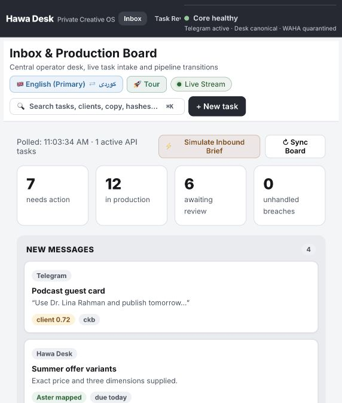
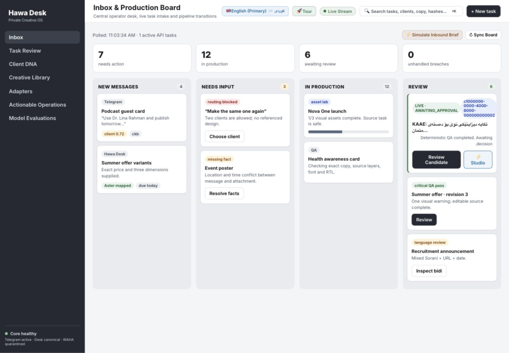

### 2. New task — poor
Clear bilingual text fields, but no client choice; technical submit label; background receives keyboard focus while modal is open. Creation against production was not submitted. Findings HQ-08/HQ-10.

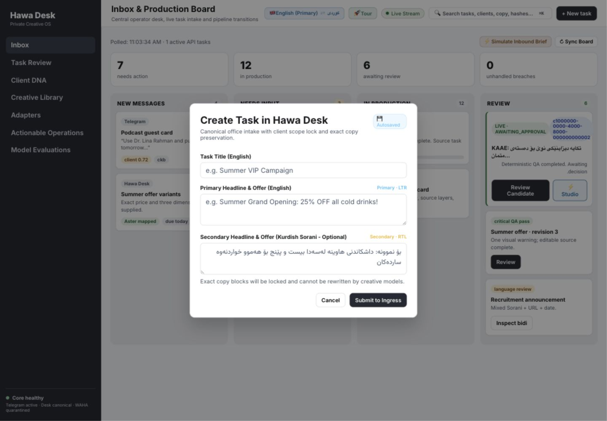

### 3. Live candidate review — poor
Editable layer controls and contrast feedback are useful. Toolbar overload, weak candidate hierarchy, altered-copy warning, and enabled publication undermine review. No live decision was sent. Findings HQ-03/HQ-04/HQ-09.

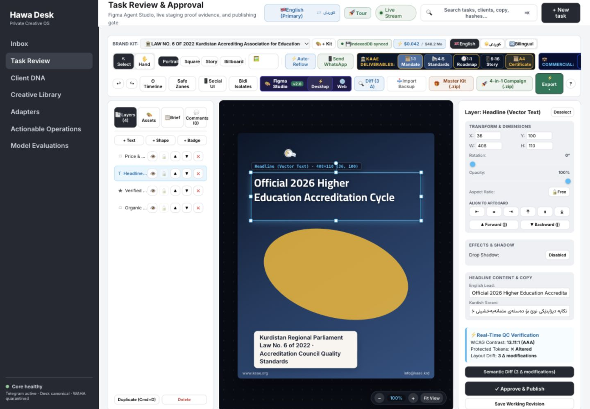

### 4. Figma proof hub — critical trust issue
Specific connection and lease claims are visible but not backed by the canonical adapter path. No external Figma write or readback was proven. Finding HQ-05.

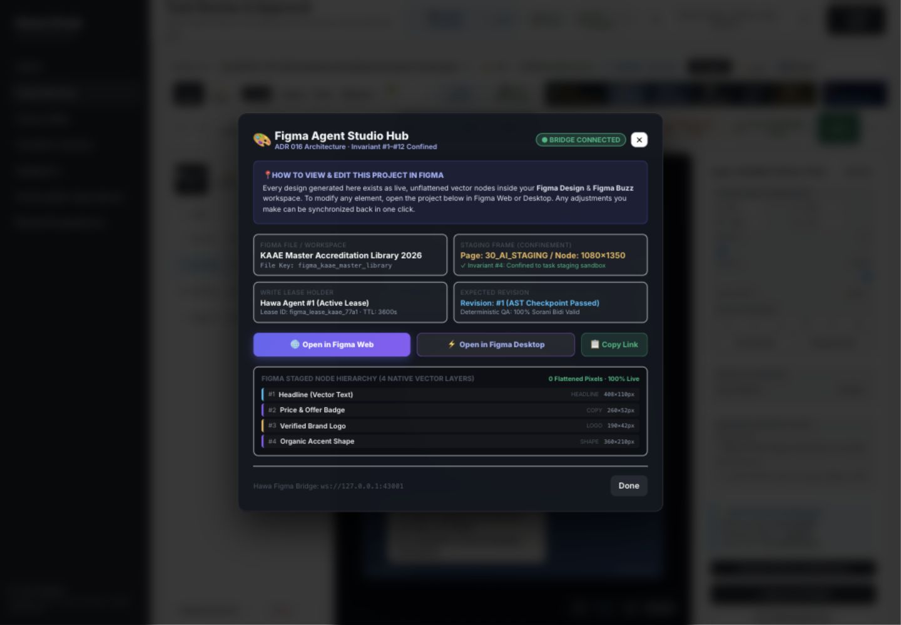

### 5. Client DNA — mixed, integrity unproven
Palette, client list, and snapshots give useful structure; small text, truncated client names, technical identity clutter, and unsupported confidence language reduce clarity. The page shows Drustee despite arriving from a KAAE review. The asset table exceeds its center panel. No brand rules were changed. Findings HQ-01/HQ-09.

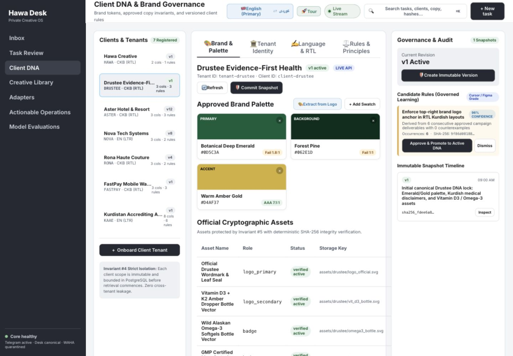

### 6. Creative library — mixed
Recognizable template cards and direct reuse actions are useful; fixed inventory totals and generic evidence claims do not establish real retrieval. No asset upload or template mutation was performed. Findings HQ-08/HQ-11.

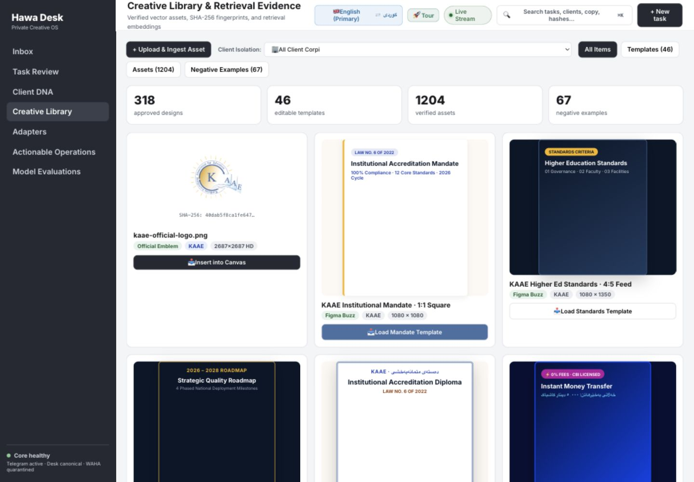

### 7. Operations — critical trust issue
A useful intended grouping of latency, failures, and reconciliation is undermined by seeded telemetry and assertions about backup age and invocations. Findings HQ-01/HQ-02/HQ-07.

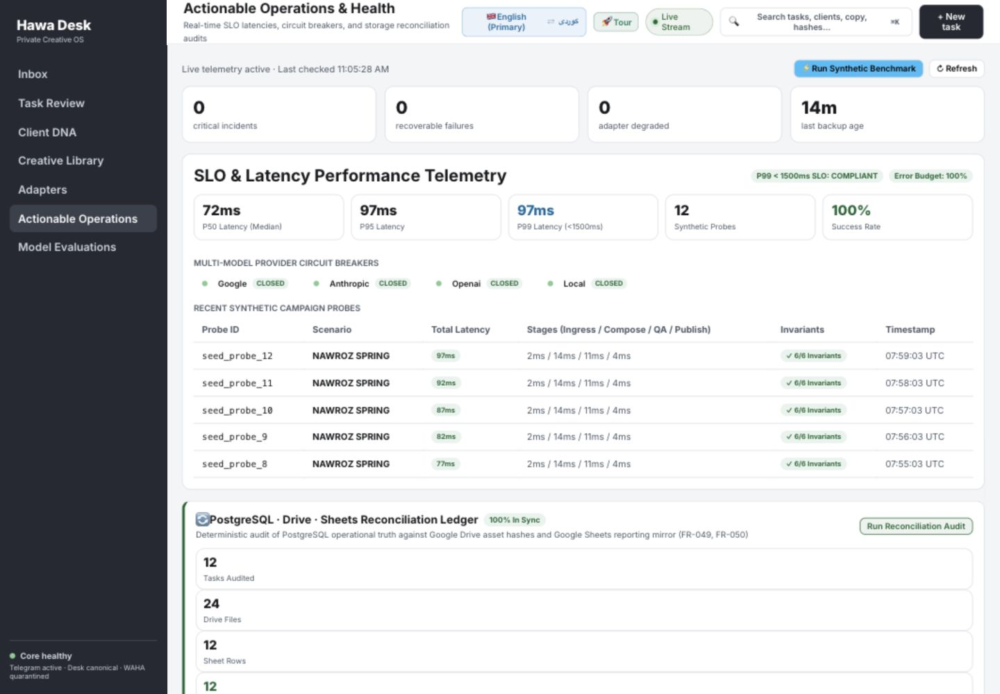

### 8. Evaluations — critical trust issue
Displays perfect results and model admission with zero visible cases. The independent wrong-answer probe confirms the evaluation weakness. Finding HQ-06.

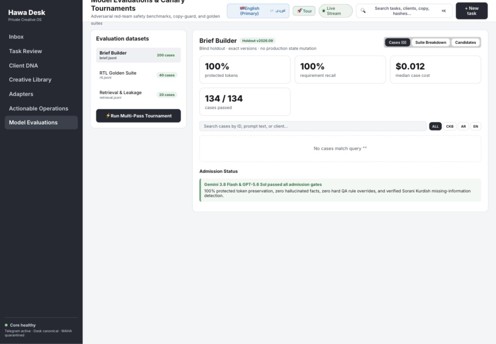

### 9. Adapters — poor
The same page shows Figma connected and sandbox emulation; WAHA quarantined conflicts with Ops healthy. Labels need one measured status source. No secret values were opened or edited. Findings HQ-05/HQ-07.

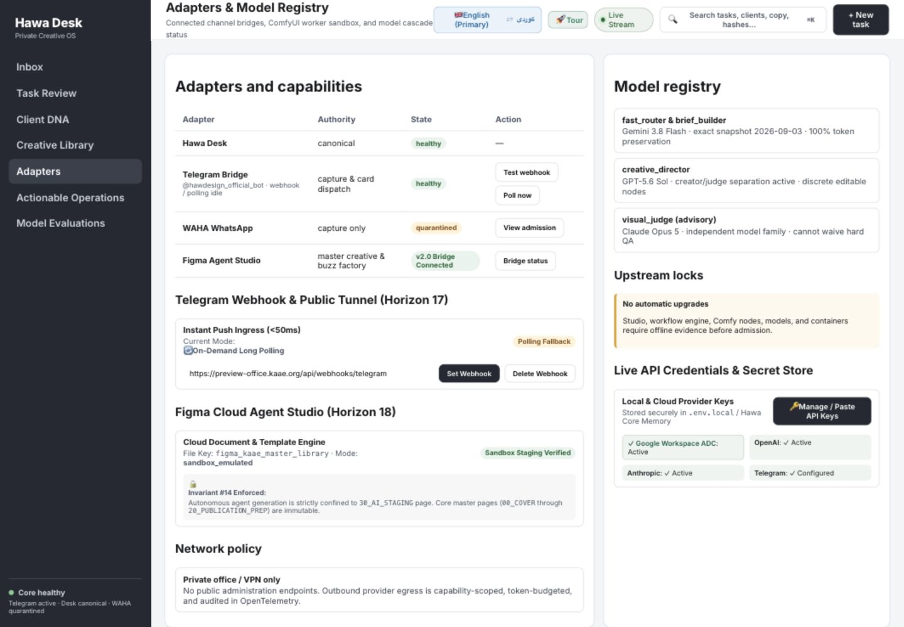

### 10. Mobile review and Fit View — poor
The outer document fits 390px, but internal controls and canvas clip. Fit View does not fit the artwork. Full keyboard, touch, assistive-technology, and multilingual conformance remain unqualified. Finding HQ-10.

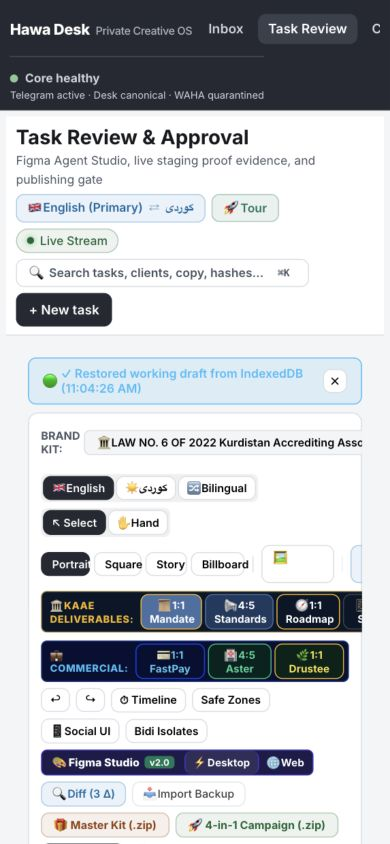
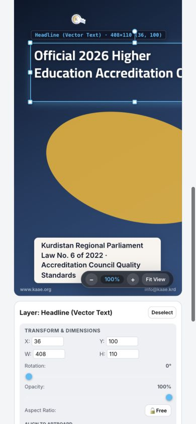
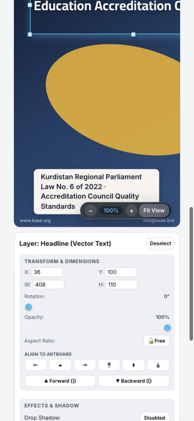

### 11. Actual approval → external delivery → restart recovery — blocked for production qualification
No success screenshot is presented because it would certify an unverified outcome. Isolated approval, publisher, and process probes reproduced failures; external writes and disruptive production restart were not performed. Findings HQ-01 through HQ-04. A genuine end-to-end production audit remains incomplete until the real boundaries are implemented and exercised.

## Evidence files

- `probes.ts`, `probes.json`, `probes.log`: isolated reproducer and final outputs. First authoring attempt had an import-path error; it was corrected before the recorded successful probe run. Distinct idempotency keys isolate the two tasks.
- `restart-probe.json`: separate process lookup output (includes a package-manager warning before JSON).
- `runtime.log`: running Restate registry, arbitrary worker path, and matching compiled core hashes.
- `tests.log`, `typecheck.log`, `desk-build.log`, `pack-validation.log`: fresh checks, including all failures and warnings.
- `source-fingerprints.json`, `evidence-sha256.json`: source and artifact fingerprints.
- `findings.csv`: audit findings mapped to requirements/gates. It records findings, not completed implementation claims.
- `REPORT.html`: standalone readable report with the screenshot gallery embedded.

No application source was changed to improve the score. This report is an audit and prioritized completion contract, not a remediation release.
