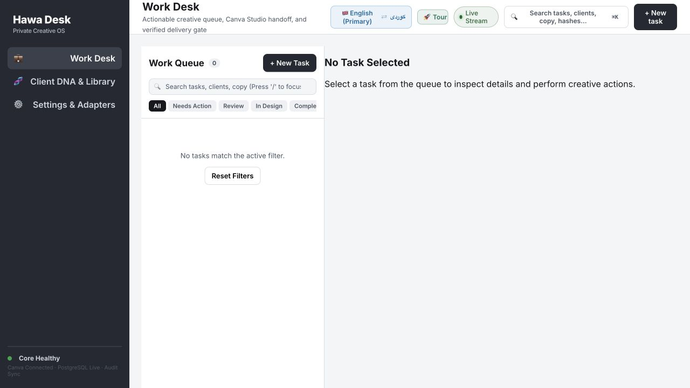
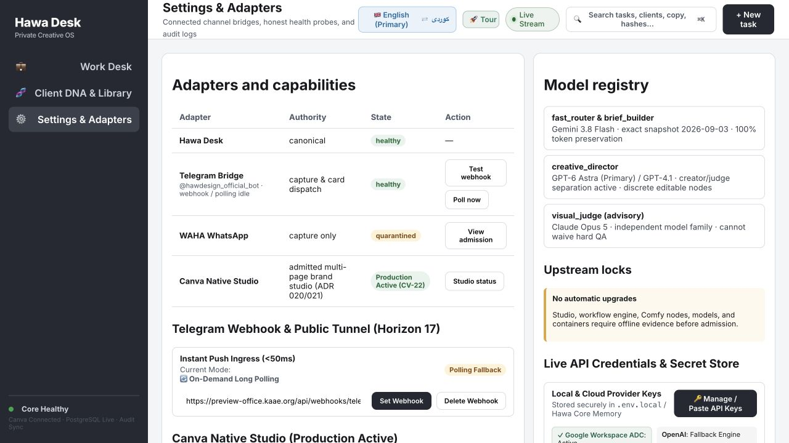
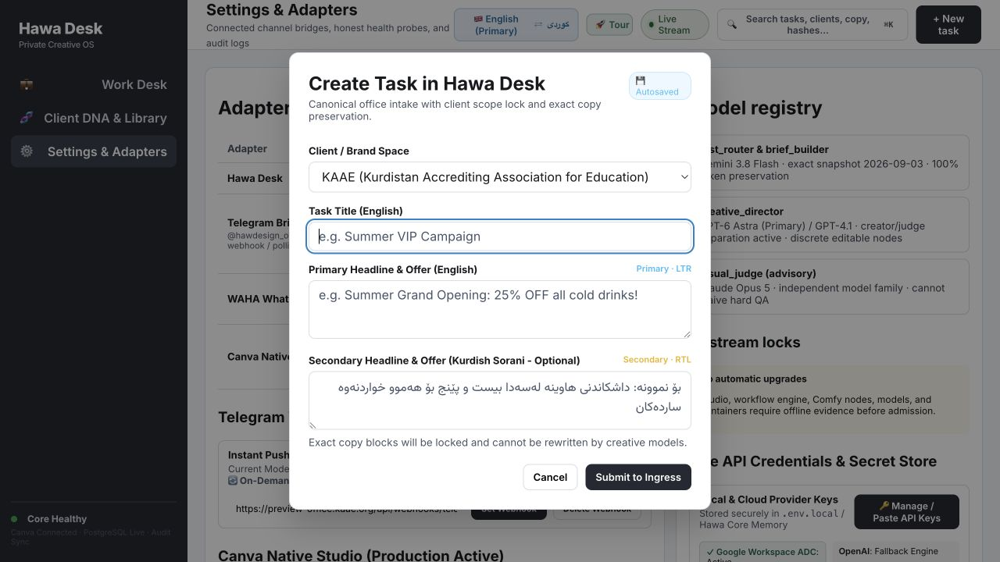
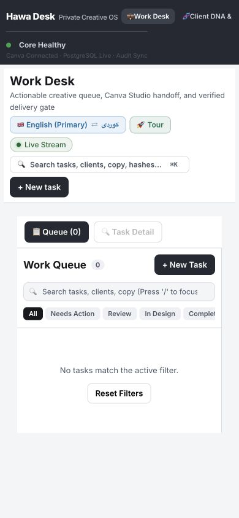

# Hawa — fresh follow-up bug hunt

**12 September 2026 · Verdict: usable for supervised experiments; reliability qualification fails.**

The recent repairs are real, but they fix individual examples more often than the underlying guarantees. This run found reproducible failures in request loading, approval semantics, model validation, prompt preservation, client isolation and export validation. A working screen or an attractive output cannot establish a trustworthy end-to-end system. No defensible “10/10” or “better than a professional designer” score follows from these results.

This is a new audit of the current dirty working tree and the running app at `http://localhost:8080`. HEAD is `d07f79a6831bb1bb87f074309534b731fea40273`; the uncommitted changes matter. Five critical source-file hashes remained unchanged during testing. Deployed image IDs are recorded separately: source probes do not establish that every changed function is deployed.

**Scope:** fresh browser inspection; read-only HTTP and production database checks; isolated current-source probes with network interception; independent Pillow/pypdf decoding; nine selected existing tests. No real task submitted, client message sent, external design changed, approval delivered, database restarted or application code modified. The in-process Core probes used production authentication mode and disposable memory, not production PostgreSQL. The full test suite and complete live Canva journey were not executed.

## What genuinely improved

Fresh results in [PROBES.json](./PROBES.json), [RENDERER_PROBES.json](./RENDERER_PROBES.json) and the current keyboard check establish:

| Earlier failure | Fresh result | Remaining limit |
|---|---|---|
| Cross-tenant adapter `apply` | Rejected | Creation idempotency still crosses tenants |
| Same-key repeated create | Same ID returned | Different payload also receives same ID |
| Render missing document | Rejected | Existing documents still use simulated adapter metadata |
| Signature-only PNG / keyword-only PDF | Rejected | Better-formed corrupt specimens still pass |
| Local-only model call | Local attribution, zero usage, no provider transport | Missing credentials with cloud policy still produce false provider attribution |
| Extra ordinary paragraph | Preserved by parser | Two paragraphs matching the same category overwrite each other |
| Unsolicited footer in original invitation | Not present in fresh template output | Generic unapproved text still passes QA |
| Failed rasterizer | Throws when both render tools unavailable | Generic logo replacement persists |
| Pilot arithmetic | Claimed 4.9062 and 100/100 match current rows | Arithmetic does not authenticate the underlying pilot |
| Task modal keyboard containment | Reverse-tab wraps inside; Escape closes and restores trigger focus | Full accessibility and submission remain untested |

## Release blockers, ordered by consequence

### H01 — Work queue silently fails to load

**Observed live + source confirmed.** A fresh browser shows zero tasks with no loading, login or network error. The deployment database contains 1,449 tasks. The desk requests `/tasks`; live GET returns **HTTP 200 `text/html`**, the SPA shell. The canonical `/v1/tasks` correctly returns JSON 401 without authentication. WorkScreen silently catches the JSON parsing failure. The fixes need both correct routing and a real session; changing only the URL is insufficient.

Evidence: [runtime.json](./runtime.json), [db-counts.txt](./db-counts.txt), screenshot 1; [WorkScreen.tsx:133](/Users/hawzhin/Hawdesign/apps/desk/src/screens/WorkScreen.tsx:133), [nginx.conf:85](/Users/hawzhin/Hawdesign/infra/docker/nginx.conf:85).

**Repair:** one typed API client with the deployed prefix; explicit unauthenticated, loading, failure, stale and empty states; successful server response is canonical. Test through the actual reverse proxy from a clean browser, not only direct in-process API calls.

### H02 — UI can fabricate capture, approval and delivery success

**Source confirmed; not clicked on a real client task.** Capture catches failures, hashes task/version/time instead of export bytes, assigns fixed file size/dimensions, sets every QA flag true and persists success locally. Approve and deliver ignore non-2xx responses and network failure. Deliver writes static Drive/Sheets links and `COMPLETE`. These are executable handlers, not merely old labels. Persisting them in localStorage makes false success survive local reloads; it does not make it durable server truth.

Evidence: [WorkScreen.tsx:311](/Users/hawzhin/Hawdesign/apps/desk/src/screens/WorkScreen.tsx:311), [WorkScreen.tsx:445](/Users/hawzhin/Hawdesign/apps/desk/src/screens/WorkScreen.tsx:445), [WorkScreen.tsx:502](/Users/hawzhin/Hawdesign/apps/desk/src/screens/WorkScreen.tsx:502).

**Repair:** retain pending state until a verified server receipt arrives. Derive file metadata from immutable bytes, QA from the server and delivery URLs from the provider. Fault-inject 401/403/409/422/429/500, invalid JSON, timeout and lost response; none may produce a success receipt.

### H03 — “Approve” is interpreted as a revision request; role verification is unsafe

**Reproduced in isolated Core.** Sending the desk payload `{action:'approve', role:'art_director'}` returns HTTP 201 with `decision:'revision_requested'`. The server reads `status/decision/outcome`, defaults unknown decisions to revision requested, and the UI claims approval regardless.

An authenticated operator also submitted `x-user-role: creative_director`, caller-provided passing QA and a nonempty invented document. The disposable no-DB instance returned `approved`, with `verifiedServerSide:true` and the claimed role. Source also allows production startup without a database and sets the no-DB QA default to passing. **Important limit:** PostgreSQL's revision repository independently requires a passing QC row; this run does not prove that caller QA alone bypasses that database guard. Header-derived role escalation and missing request validation still require correction.

Evidence: [CORE_PROBES.json](./CORE_PROBES.json); [app.ts:4270](/Users/hawzhin/Hawdesign/apps/core/src/app.ts:4270), [app.ts:4316](/Users/hawzhin/Hawdesign/apps/core/src/app.ts:4316), [app.ts:4670](/Users/hawzhin/Hawdesign/apps/core/src/app.ts:4670), [revision.repository.ts:236](/Users/hawzhin/Hawdesign/packages/db/src/repositories/revision.repository.ts:236).

**Repair:** strict shared decision enum; unknown payloads return 400. Identity and project/client reviewer grants come from authenticated server records. Require revision, capture-set, QA and expected-version binding atomically. Production cannot accept work without durable storage. Tests must use real PostgreSQL and the production auth path, alongside disposable unit cases.

### H04 — Active Canva adapter remains simulated; new REST client is not connected to it

**Source and isolated execution confirmed.** Creating a design without any network produces a locally minted `DAF_...` ID and edit URL. A new adapter cannot find it. Core still constructs `CanvaDesignStudioAdapter` around `CanvaNativeAdapter`; `CanvaConnectClient` appears in its new source and tests, not in the inspected application call chain.

Its client-secret branch submits `grant_type=client_credentials`. Canva documents user authorization through Authorization Code + PKCE, followed by authorization-code and refresh-token grants. A client secret pair alone is not a user authorization. A mocked token response cannot validate this integration. [Canva authentication documentation](https://www.canva.dev/docs/connect/authentication/).

Evidence: [PROBES.json](./PROBES.json), [ADVERSARIAL.json](./ADVERSARIAL.json) `canvaAuth`; [canva-design-studio-adapter.ts:75](/Users/hawzhin/Hawdesign/packages/integrations/src/canva-design-studio-adapter.ts:75), [app.ts:271](/Users/hawzhin/Hawdesign/apps/core/src/app.ts:271), [canva-connect-client.ts:99](/Users/hawzhin/Hawdesign/packages/integrations/src/canva-connect-client.ts:99).

**Repair:** a single real adapter and user-scoped OAuth lifecycle, durable task/design binding and reconciled operations. If an operation is only supported manually, expose a clear native Canva handoff and verify its result. Keep mocks behind explicit test injection.

### H05 — Idempotency can return another tenant's design

**Reproduced.** Tenant A creates using key `shared-key`; tenant B uses that key and receives exactly A's document. A changed payload with the same key also receives the original document. The new map is keyed only by the supplied key and returns before scope checks.

Evidence: [ADVERSARIAL.json](./ADVERSARIAL.json) `idempotency`; [canva-design-studio-adapter.ts:75](/Users/hawzhin/Hawdesign/packages/integrations/src/canva-design-studio-adapter.ts:75).

**Repair:** durable tenant/client/task/operation-scoped keys with canonical request hashes, collision rejection and unique constraints. Test concurrency and process restart. Adapter-level reproduction does not alone prove an externally reachable tenant exploit.

### H06 — Model responses are manufactured, not schema-validated

**Reproduced.** An intercepted provider returns `{}`; the gateway inserts required `passed:true` and labels it `live_provider`. With no keys, an explicitly orange asymmetric landscape brief gets a navy/gold centered invitation, `ok:true`, OpenAI/Sol attribution, and invented 520/140 token usage. `provenance:deterministic_fallback` is an improvement, but the rest of the receipt still falsely implies provider execution. The timestamp-based `responseHash` is not a content hash.

Evidence: [ADVERSARIAL.json](./ADVERSARIAL.json) `synthesizedPass`, `missingCredentials`; [model-gateway.ts:482](/Users/hawzhin/Hawdesign/packages/integrations/src/model-gateway.ts:482).

**Repair:** actual JSON Schema validation; no invented required values. Missing credentials/unavailable model must return an explicit unavailable/degraded result. Require measured usage or unknown, cryptographic content hashes and accurate transport provenance.

### H07 — Retry limit, circuit breaker and visual input guarantees are incomplete

**Reproduced with intercepted transports.** `maxAttempts:1` led to four external request attempts and a fifth local candidate. Real HTTP 503 responses left the OpenAI circuit at zero failures. When Opus had no usable image, fallback Google received text only and a mocked `passed:true` was accepted. This proves the wrapper accepts a blind verdict; it does not establish any real model's quality.

Evidence: [ADVERSARIAL.json](./ADVERSARIAL.json) `attemptBudget`, `blindJudge`, `visionRequests`; [model-gateway.ts:209](/Users/hawzhin/Hawdesign/packages/integrations/src/model-gateway.ts:209), [model-gateway.ts:271](/Users/hawzhin/Hawdesign/packages/integrations/src/model-gateway.ts:271).

**Repair:** enforce total attempts, deadline/cancellation and cost reservation across the entire cascade; record real transport failures. Every vision route must verify and send the correct revision's authorized image bytes. No-image verdicts are unavailable, never passed. Avoid accepting arbitrary filesystem paths as image asset identity.

### H08 — Brief fidelity remains vulnerable to overwriting and invented copy

**Reproduced.** Appending a second paragraph containing “Prime Minister” overwrites the original keynote paragraph. Exact-copy QA and the unsolicited-content check return no findings for an extra invented RSVP deadline/admission fee, or duplicated approved copy. The unsolicited checker recognizes four specific phrases; it is not an allowlist of authorized facts.

Evidence: [ADVERSARIAL.json](./ADVERSARIAL.json) `parserCollision`, `copy`; [kaae-invitation.template.ts:44](/Users/hawzhin/Hawdesign/packages/creative/src/templates/kaae-invitation.template.ts:44), [copy-validator.ts:10](/Users/hawzhin/Hawdesign/packages/qa/src/copy-validator.ts:10).

**Repair:** retain immutable original text blocks with source spans and stable IDs; model labels must not destroy or replace text. Require bidirectional coverage between approved content and editable nodes, with explicit allowed brand phrases. Preserve ordered content and reject unexplained additions, omissions, duplication or conflicting facts.

### H09 — Valid-checksum image and comment-only PDF pass export QA

**Reproduced and independently checked.** A 66-byte PNG declares 1080×1350 RGBA but inflates to one byte. Current validator accepts it. Pillow cannot decode the pixels. A 238-byte PDF with structural words inside a comment is accepted as a CMYK 300 DPI print file with an “embedded” font; pypdf rejects it because no `startxref` exists. Neither claimed print quality nor font embedding was measured.

Evidence: [ADVERSARIAL.json](./ADVERSARIAL.json) `artifacts`, [independent-decoders.json](./independent-decoders.json), both invalid files; [canva-capture-pipeline.ts:103](/Users/hawzhin/Hawdesign/packages/integrations/src/canva-capture-pipeline.ts:103), [canva-capture-pipeline.ts:149](/Users/hawzhin/Hawdesign/packages/integrations/src/canva-capture-pipeline.ts:149).

**Repair:** decode pixels with bounded dimensions, memory and time; parse and render actual PDF page trees, embedded font programs and color/profile objects. Measure effective image resolution where relevant instead of assigning every PDF “300 DPI.” Validate all formats against the same captured revision and independently recompute hashes.

### H10 — Another client's logo can become KAAE's logo

**Reproduced without changing assets.** A node named `another_client_logo`, pointing to another client's asset/hash, produces SVG containing the KAAE logo. The renderer treats any node ID containing `logo` or generic logo role as KAAE. Other image assets become placeholder rectangles. Hash identity and client authorization are not respected by this render path.

Evidence: [RENDERER_PROBES.json](./RENDERER_PROBES.json); [operations-to-svg.ts:99](/Users/hawzhin/Hawdesign/packages/creative/src/operations-to-svg.ts:99).

**Repair:** resolve the exact immutable asset reference within locked client scope, verify bytes/hash, preserve the intended image and fail closed on missing assets. Never infer a brand from a node's name. Run multiple real client fixtures.

### H11 — Feedback can silently become permanent rules for the wrong brand

**Source confirmed; not executed because the handler writes actual brand files.** Telegram feedback is classified by keywords, proposed, then automatically promoted using the literal role `creative_director`, although the recorded actor is an operator. The next section finds and writes `kaae.dna.json` without checking that the feedback's client is KAAE. A temporary correction can therefore become a persistent brand rule; another client's feedback can target KAAE's configuration.

The same path can fabricate a task object for a UUID found in a reply when no in-memory task exists. It needs durable lookup and channel/actor/task binding before treating the reply as authoritative.

Evidence: [app.ts:2164](/Users/hawzhin/Hawdesign/apps/core/src/app.ts:2164), [app.ts:2337](/Users/hawzhin/Hawdesign/apps/core/src/app.ts:2337), [app.ts:2359](/Users/hawzhin/Hawdesign/apps/core/src/app.ts:2359). This conflicts with [governed learning requirements](/Users/hawzhin/Hawdesign/docs/18_FEEDBACK_LEARNING.md).

**Repair:** task-scoped corrections apply to that task. Persistent rules require explicit authorized scope, immutable versions, conflict checks and reversible promotion. Resolve client configuration by validated client identity. Unknown reply task IDs must not create authority.

### H12 — Health/model claims outrun recorded execution; qualification is unproven

**Observed UI + read-only DB + source.** Settings shows Astra as primary, Opus as judge, Canva “Production Active,” while the inspected gateway's creative primary is Sol. The Core/creative path inspected has no `generateStructured` call connecting that gateway to design production. Database snapshot: 1,449 tasks, 173 revisions (all labelled `hycanvas`), zero model invocations, design briefs, Canva bindings or capture sets. The revision repository still defaults new revisions to `hycanvas`; historical labels alone are not proof of the actual renderer.

The health badge says Canva connected because the circuit is not open, which does not establish a successful authenticated Canva operation. Current pilot arithmetic is consistent, but no new independent pilot provenance was established.

Evidence: screenshot 2; [db-counts.txt](./db-counts.txt), [model-gateway.ts:83](/Users/hawzhin/Hawdesign/packages/integrations/src/model-gateway.ts:83), [app.ts:1009](/Users/hawzhin/Hawdesign/apps/core/src/app.ts:1009), [revision.repository.ts:95](/Users/hawzhin/Hawdesign/packages/db/src/repositories/revision.repository.ts:95).

**Repair:** displayed model and connection state must come from actual admitted runtime configuration and recent authenticated checks, including unknown/expired states. Demonstrate a fully correlated request→brief→real model→Canva edit→captured files→QA→human approval→delivery chain before a pilot claim. Account model access and design quality require separate evidence.

## Fresh UI walkthrough

1. **Work queue — failing.** Three main navigation destinations are simpler than the old tab-heavy shell. But the empty-state message conceals a load failure, the Complete filter is clipped, and a green health badge conflicts with the actual request result. The white-heavy workspace also remains contrary to the user's expressed preference. The empty canvas is not a usable review surface.

2. **Settings — misleading.** Canva is clearly named as the studio, but declarations such as “Production Active,” model names and “100% token preservation” are not runtime proof. Technical and operational controls compete with the core task. Small low-contrast footer status is an accessibility risk; no measured WCAG claim is made. No Figma editor was encountered in the captured navigation; that does not certify every route or asset is removed.

3. **New task — partly healthy.** Visible focus, labels, reverse-tab wrap and Escape/return-focus work. The form provides headline/copy fields but no separate design-instructions or reference attachment area in this modal. Defaulting to KAAE is risky for a multi-client office unless scope is deliberately confirmed. Autosave needs an explicit local-draft label and state ownership. Submission was not performed on the live system.

4. **Mobile queue at 390×844 — needs work.** Queue/detail switching is a useful adaptation. Header controls consume almost 330px before queue content, navigation runs beyond the visible width, and the Complete filter is cut off. Two New Task buttons and multiple status/search rows take scarce space. Full task review was blocked by the empty queue; mobile Canva return and export handling remain untested.

5. **Live task review → Canva → capture → delivery — blocked/unverified.** The clean-session queue failed, and this audit did not create or publish a real task. Backend and source probes above identify failures but are not substitutes for a live journey recording.

## What the tests mean

The two selected existing suites pass **9/9 tests** ([log](./selected-tests.log)). The adversarial probes still expose the failures above. Passing a mocked authentication test or a blacklist example is much narrower than passing the production contract.

The executable audit scripts and raw outputs are kept beside this report. The full suite, isolated PostgreSQL concurrency/restart tests, authenticated end-to-end Canva export, print inspection, paid model calls and blinded design-quality evaluation remain **NOT RUN in this audit**. Their absence is an evidence gap, not a claim that they all fail.

Use [GEMINI_TASK_SHEET.md](./GEMINI_TASK_SHEET.md) as the repair contract. Start with H01–H03 and a real H04/H12 vertical slice. Do not spend the next iteration on new tools, more tabs, extra model names or unsupported percentage claims.
