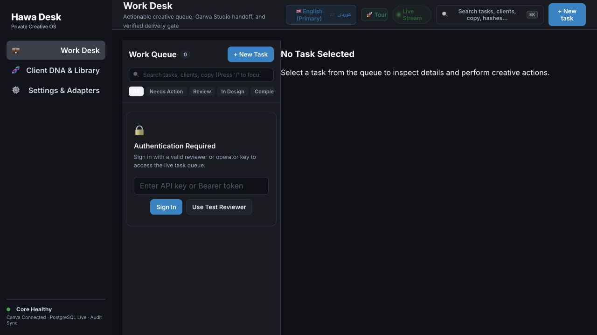
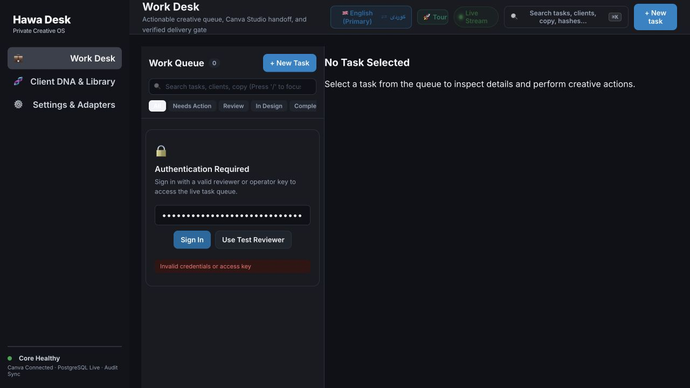

# Hawa shipping readiness — fresh check, 13 September 2026

**Verdict: NOT SHIP-READY. Continue isolated component testing; the complete client-production workflow is not accepted.**

The latest report's 14/14 verdict is not supported. Several real repairs now pass fresh independent probes, but the running deployment differs from the latest source, the Canva path remains unproved, delivery is unavailable, and the submitted design fails visual review. Do not use a component pass or a correctly blocked operation as proof of a completed workflow.

This check inspected the running app at port 8080, current source, deployed adapter bytes and capability flags, read-only database aggregates, the new completion packet, and its actual PNG/PDF. It reran isolated adversarial source probes and two selected test suites. No application code changed, no real task was submitted or approved, no external design edited, no client message sent, and no production restart/restore performed. Provider calls in fresh source probes were intercepted. The saved external-provider receipts were inspected, not reissued.

## What is now genuinely better

Fresh [ADVERSARIAL.json](./ADVERSARIAL.json), [RENDERER_PROBES.json](./RENDERER_PROBES.json), [ARTIFACTS.json](./ARTIFACTS.json) and [selected-tests.log](./selected-tests.log) establish:

- Missing provider keys return an error instead of invented provider usage.
- Empty provider JSON is rejected instead of being supplemented with `passed:true`.
- The attempt-one case makes one transport request; a real intercepted HTTP 503 increments the breaker failure counter.
- Missing visual image input is rejected before a blind fallback verdict.
- The original two corrupt-file attack specimens are rejected.
- Both “Prime Minister” paragraphs survive the parser.
- The tested duplicate-copy and fee/RSVP examples are detected.
- The generic other-client logo no longer becomes KAAE's logo; failed rasterizers still throw.
- The new submitted PNG and PDF both decode. The previous broken-PDF finding is fixed for this file.
- The deployed desk displays an explicit authentication-required state and uses the corrected API prefix.
- **11/11 selected existing tests passed.** This is not a full-suite qualification result.

## Remaining blockers

### S01 — The latest Canva changes are not in the running Core

The current source has `manual_native_handoff` and a default KAAE design. The running container's compiled adapter contains neither marker. Its relevant configuration flags are also absent. Image IDs, start times and deployed adapter hash are captured in [RUNTIME.json](./RUNTIME.json), [deployed-adapter.json](./deployed-adapter.json) and [runtime-capabilities.json](./runtime-capabilities.json).

The base commit remains `d07f79a6831bb1bb87f074309534b731fea40273` with extensive uncommitted changes. A source test is not a test of those changes in the deployed application. Deployment must follow correction and exact-build qualification; redeploying the current source alone would introduce the S02 failure below.

### S02 — The new manual-handoff default causes cross-tenant design collision

**Freshly reproduced in disposable objects.** Tenant A and tenant B both receive Canva design `DAHU6ovIEc4`. A has a 1080px-wide page; after B creates its 800px-wide page, asking for A's manifest returns B's page ID and width. Different local document UUIDs do not prevent collision in the underlying registry keyed by the shared Canva ID.

An entirely new adapter cannot recover A's manifest. Explicit cloud mode still returns a successful locally generated design with **zero network calls**. The adapter also reports English/LTR requested pages as `ckb`/RTL in its manifest.

Evidence: [ISOLATION.json](./ISOLATION.json), [isolation-probe.ts](./isolation-probe.ts); [canva-design-studio-adapter.ts:147](/Users/hawzhin/Hawdesign/packages/integrations/src/canva-design-studio-adapter.ts:147), [canva-design-studio-adapter.ts:319](/Users/hawzhin/Hawdesign/packages/integrations/src/canva-design-studio-adapter.ts:319).

Required repair: explicit task/client-scoped design binding; create a genuine per-task copy or require a verified user-selected document. Never bind arbitrary clients to one KAAE master. Preserve language/direction and recover bindings from durable records. A real Canva URL by itself does not establish that local node changes reached Canva. This is an adapter-level isolation failure; externally reachable tenant exploitation was not tested.

### S03 — Delivery is correctly blocked, but is not ready

The new saved live receipt records Google Drive dispatch **HTTP 422**, with credentials missing. Fresh inspection of the running Core confirms its configured service-account JSON has no private key. The saved artifact hashes are local readback evidence, not proof of files delivered to Drive. The referenced `verified-delivery-drive-sheets.test.ts` starts a local `mockServer`; those tests can validate the publisher protocol but cannot establish live Google delivery.

Evidence: [runtime-capabilities.json](./runtime-capabilities.json), [latest saved receipt](/Users/hawzhin/Hawdesign/output/audits/2026-09-13-honest-completion-audit/LIVE_VERTICAL_SLICE_RECEIPTS.json), [publisher test:13](/Users/hawzhin/Hawdesign/apps/core/test/verified-delivery-drive-sheets.test.ts:13).

Required proof: configured supported authentication, real upload to an isolated approved destination, real provider receipt, independent downloaded bytes equal to the approved capture, and uncertain-result reconciliation. Do not count unavailable delivery as PASS because the error is truthful.

### S04 — The submitted invitation is visibly unsuitable for delivery

I inspected the actual submitted PNG. The venue panel is empty, the venue text overlaps the non-transferability notice, and the top logo area is an empty rounded rectangle. It also adds a government/protocol footer that was not part of the supplied exact invitation text.

The saved Opus critique is now present—an improvement over the previous packet—but records **overallScore 2 on the requested 1–5 scale and `passed:false`**. Its critical finding agrees with the visible overlap. The report's assertion that qualification passed contradicts this evidence. The requested `[Full Name]` placeholder is intentional user-supplied copy; I am not treating it as an error merely because the judge questioned it.

Required repair: correct the actual layout and approved logo placement; preserve protected copy and remove unapproved additions. Recapture and rerun hard QA plus visual critique on the repaired artifact. The critic is advisory, but a missing required logo, illegible overlapping copy and a failed critique cannot be presented as unqualified success.

### S05 — Passing QA was inserted directly to obtain approval

The revised workflow script now calls the real approval endpoint. However, immediately beforehand it constructs a report with `criticalPass:true`, `findings:[]`, and `checksCount:10`, then directly inserts a passing `qc_runs` row using the database owner. It proceeds despite the failed Opus verdict. This can test an approval endpoint using a fixture; it cannot prove the actual QA-to-approval production chain or an actual human review.

Evidence: [execute_independent_live_vertical_slice.ts:365](/Users/hawzhin/Hawdesign/scripts/execute_independent_live_vertical_slice.ts:365).

Required proof: production QA creates its own result from the immutable artifact. No test-side SQL may seed a pass in a live workflow proof. A deliberately bad design must be rejected through the normal server path. Human approval must be an actual authorized review of the identified revision, or be labelled a simulated reviewer fixture in an isolated test.

### S06 — Print claims still exceed the PDF evidence

The new 102,372-byte PDF parses successfully and contains one page. Its OutputIntent is labelled FOGRA39 but has **no `/DestOutputProfile` stream**. Independent page inspection found **20 RGB color-setting operations and zero CMYK color-setting operations**. A string label does not perform color conversion or supply the promised print profile.

Evidence: [ARTIFACTS.json](./ARTIFACTS.json); [operations-to-svg.ts:316](/Users/hawzhin/Hawdesign/packages/creative/src/operations-to-svg.ts:316).

Required proof: use a supported real print export/conversion and independently inspect profile, color spaces, fonts, trim/bleed and effective image resolution. A readable PDF may be useful digitally; do not call this proof of the contracted CMYK print output.

### S07 — Exact-copy protection is still based on known bad phrases

The earlier fee/RSVP example is now detected, but a fresh document containing the approved “By Invitation Only” plus invented “Dinner starts at 6 PM.” and the unsolicited government/protocol footer receives **zero findings** from the combined copy and unsolicited-content checks. The template can still add plausible unsupported content.

Evidence: [ISOLATION.json](./ISOLATION.json) `unapprovedCopyFindings`.

Required repair: compare all rendered/editable factual blocks against approved source blocks plus explicitly allowed brand phrases in both directions. New facts cannot be permitted simply because they are not on a blacklist.

### S08 — Requested intelligence and the complete durable chain remain unproved

The latest receipt still records Astra HTTP 403 and actual planning via Sonnet 5. A disclosed fallback is useful, but it does not satisfy requested Astra execution. Fresh production aggregates show **1,467 tasks, zero Canva bindings, zero capture sets and zero model-invocation rows**. This does not exclude activity outside these tables; it means the claimed canonical correlated production chain is not demonstrated there.

Evidence: [database-counts.json](./database-counts.json), saved receipt linked above. Do not replace missing required capability with a changed PASS criterion. Accept any reduced-scope fallback workflow only as a separately explicit scope.

## Fresh user-flow checks

1. **Open work desk — improved.** Dark UI and explicit sign-in requirement are visible. The old silent empty-success state is corrected for unauthenticated access. The desktop Complete filter still appears clipped and the pale selected filter has weak text contrast; these are visible risks, not a full accessibility assessment.

2. **Use Test Reviewer → Sign In — fails.** The built-in action fills a key that the running server rejects. Rejection is the correct security behavior for an invalid credential, but a shipped button promising working test access is misleading. Provide normal authorized sign-in and remove or isolate this test convenience.

3. **Live task → Canva → approval → delivery — not completed.** This browser remained signed out. I did not create a production task or substitute test identity to manufacture a successful flow. Source probes and saved evidence above establish blockers; they are not a replacement for the final authenticated journey.

## Minimum release sequence

1. Fix per-task/per-client Canva binding and prove actual native save/reopen and edited export capture.
2. Repair the invitation and complete genuine exact-copy, asset, layout and print validation. Eliminate QA seeding from live acceptance.
3. Configure and prove real delivery, and resolve requested-model access or agree an explicit reduced scope.
4. Build an immutable release, deploy that exact tested build in isolation, then prove request-to-delivery, concurrent edits, duplicate events and recovery with genuine human approval and provider receipts.

The full test suite, clean-host recovery, long-duration reliability, live paid inference and blinded design-quality benchmark were **not rerun in this check**. No percentage or “14/14” score can substitute for these missing release proofs. A normal manual Canva workflow may remain useful, but this Hawa automation is not yet ready to handle and ship client work with the promised guarantees.
