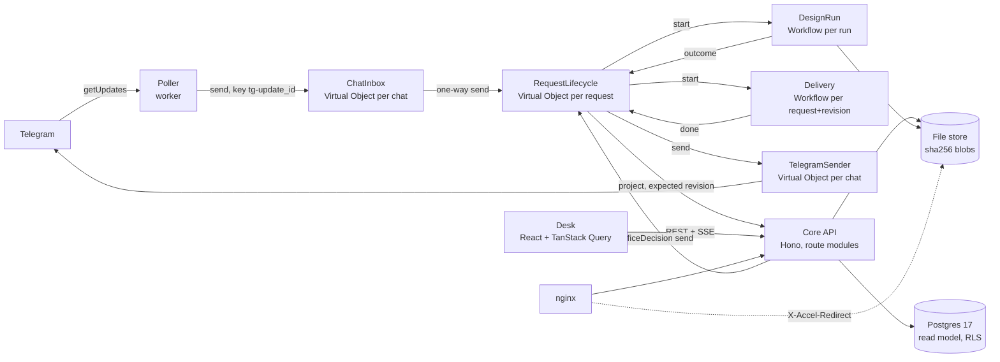

# Hawa architecture programme

**Date:** 2026-09-24 · **Base:** `studio-v2` at `9644f91` (deployed) · **Status:** approved by the owner on 2026-09-24 ("yes, do all"), all phases; implementation in progress
**ADRs drafted with it (Proposed):** ADR-034 request lifecycle on Restate · ADR-035 content-addressed file store · ADR-036 renderer-neutral SVG and the resvg gate · ADR-037 Desk server state

This plan turns the eight improvements named on 2026-09-24 into phased, measurable work. Every change has a measured need (AGENTS.md), a proof before it ships, and a way back. It is based on the two review rounds of 2026-09-24 (about 95 bugs, each reproduced by a failing test) and on four research reports written for this plan: the codebase inventory, Restate, resvg against rsvg, and the supporting technology. Sources are listed at the end.

Real requests are **not** blocked by this plan. Phase 0 should land within the first week of real use, before the office as a whole is invited.

---

## 1. Why: where the bugs came from

About 95 bugs over one day of review fall into four structural weak spots.

| Weak spot | Evidence |
|---|---|
| **State a restart loses.** Core holds 24 stateful maps and sets; several are read before Postgres. | A delivery stuck in PUBLISHING after a restart; Canva imports stuck in `submitted`; studio runs nobody abandoned; outcomes lost when Core was down; `act:` approval buttons dead after a restart; clarification answers lost; nine call sites read a stale cached status (`tasks.get(id) \|\| resolveTaskWithFallback(id)`), which feeds delivery, publish and decisions. Core cannot run two replicas. |
| **One 11,214-line `app.ts`.** 94 routes, one 1,647-line Telegram closure, route order that is load-bearing. | Most fixes landed in it; parallel fixers had to be split by line ranges. 8 routes are unreachable duplicates (the live DNA-snapshots route is the memory-only one); `POST /tasks/:taskId/:control` intercepts six later POSTs; six tests read the file's text. |
| **Five vocabularies for one task status.** DB enum (22), JSON schema (21), OpenAPI, domain type (19), Desk (22 plus aliases), and in-memory words (`IN_PROGRESS`, `CHANGES_REQUESTED`, …). | Unknown words silently become `received`; the Desk showed six states as RECEIVED; `task:transitioned` has four payload shapes; an unknown status could be approved in the Desk. |
| **Pictures as base64 inside rows and data URIs.** | A reference photo is written three times in Postgres (twice in one `task_events` row) plus Restate; rsvg refuses an attribute over 10 MB, so a rotated 12 MP photo failed every render; reply lookups scan JSON carrying images; `GET /tasks/:id` returns a PNG as a data URI; in the test database 265 MB of 334 MB is PPTX sources inside `canva_design_plans`. |

Research added three more risks this plan must handle first:

1. **Deploys replay running work on new code.** The worker is re-registered at the same address (`http://worker:9080`) on every deploy, with a `force: true` fallback. Restate pins each invocation to a deployment; replacing the container behind that address replays in-flight journals on changed code, which Restate's error reference names as the cause of journal mismatches (RT0016). Today's deploys were safe only because nothing was in flight.
2. **Network calls inside open transactions.** The outbox consumer runs each handler inside the command's transaction; a Telegram document upload can take 60 s while `idle_in_transaction_session_timeout` is 30 s. The session can be killed after the send and the delivery sent again (from the code; not reproduced).
3. **Desk load grows with tasks and tabs.** The Desk reads every page of `/tasks` every 30 s and 1 s after every task event; each row runs six correlated subqueries, two on unindexed columns; `/ready` is the same heavy handler as `/health` and Docker polls it every 10 s.

## 2. Principles

1. **Measured need, measured result.** Each workstream names its baseline and its target number before work starts, and reports both after.
2. **Strangler, not rewrite.** One slice at a time; the old path stays until the new one has run in production; every slice can be switched off (per-chat flag) or rolled back.
3. **Tests before moves.** Behavioural and contract tests replace text-matching tests before code moves. Reviewers' failing tests are the acceptance tests.
4. **No handler waits for a person.** Waiting is state; each event is a short handler. (This is what makes Restate deploys safe.)
5. **Every side effect has a deterministic key** (`requestId:revision:step`), and every boundary reconciles before acting.
6. **One owner per fact.** Postgres for what the Desk reads, Restate object state for where a request is in its life, the file store for bytes. Nothing in Core's memory holds truth.
7. **An ADR before a foundation changes**; the lead re-runs every proof an agent reports.

## 3. Target architecture

- **Restate** decides transitions. **Postgres** is the projection the Desk reads, written by Core with expected revisions. **Core** is the API and the domain services, with no lifecycle state of its own.
- Reminders are delayed self-sends ("next office morning"), which run on whatever code is current when they fire.
- The worker runs as two colours (blue/green), each registered at its own address; a deploy goes to the drained colour.

## 4. Phases

Effort is in engineer-days for one senior engineer working with review agents (about 67 in total); phases overlap where noted. Calendar estimate: **8–10 weeks**.

### Phase 0: Safety before scale (week 1, about 6 days)

| # | Change | Acceptance | Effort |
|---|---|---|---|
| 0.1 | **Blue/green worker deploys.** Two worker services at their own addresses; deploy to the idle colour after a drain query (`sys_invocation WHERE pinned_deployment_id = … AND status <> 'completed'` returns 0); register with `force: false`; remove the `force: true` fallback; delete the drained deployment. Upgrade the Restate server 1.7.0 → 1.7.10 (patch). Health reports paused and backing-off invocations and inbox depth. | A deploy with a design in flight: the design finishes on the old colour, no RT0016, no replay on new code. | 2 d |
| 0.2 | **No network calls inside a transaction.** Outbox: claim and commit, act with the command's key, record the result in a second transaction; claims select columns, not `RETURNING *` with images. | A 60 s send with a 30 s idle timeout completes once; a killed worker after the send does not send again. | 1 d |
| 0.3 | **Desk and health load.** The list endpoint pages on the server (keyset on `created_at, id`), drops the `intake_data` JSON, gets indexes on `qc_runs(task_id, started_at DESC)`, `approvals(task_id, created_at DESC)`, `tasks(tenant_id, created_at DESC) WHERE deleted_at IS NULL`; the Desk stops reading all pages and coalesces event refreshes; `/ready` becomes a cheap liveness check; the sidebar polls health only while visible. | `GET /tasks` p95 ≤ 150 ms at 5,000 tasks (from nginx `rt=`); one open Desk tab makes ≤ 2 list requests a minute when idle. | 1.5 d |
| 0.4 | **Telegram safety.** Remove `poll-now` or lock it with the poller; persist the offset; honour the Telegram kill switch; stale-status call sites read Postgres; delivery ignores memory approvals. | A 5xx on one update never advances past it; the kill switch stops intake; the nine call sites read the database. | 1 d |
| 0.5 | **Renderer fixes with no new dependency.** No whitespace between `<tspan>`s (fixes a 7–14 px shift on centred and end-anchored lines today); right-to-left lines as `U+202B … U+202C` with left-to-right anchors (measured byte-identical on librsvg 2.54 and 2.62); logo pre-scaled once (about 85 ms per render); image type from magic bytes, not file extensions; a font check that compares rendered ink width with fontkit's (catches the Mac's different Noto Sans Arabic). | Stored-run renders identical except the line-shift fix; the font check fails on a host with the wrong Noto file. | 1 d |
| 0.6 | **Owner items.** Rotate the committed `hawa_app` password by alternating login roles (`hawa_app_a`, `hawa_app_b` inheriting `hawa_app`), then `hawa_app NOLOGIN`; the Google Drive key. | The leaked password no longer logs in; a delivery is archived. | owner + 0.5 d |

### Phase 1: Foundations for change (weeks 2–4, about 21 days, parallel streams)

**1.1 Tests on their own databases (3 d).** A `globalSetup` builds `hawa_tpl_<hash of schema, RLS, migrations, seed, fixtures>` under an advisory lock (worktrees share the server), from `template0` with explicit encoding and locale, marked `IS_TEMPLATE` with connections off; roles are created once (they are cluster-wide). Each test file clones `hawa_t_<random>` in `beforeAll` and drops it `WITH (FORCE)` in `afterAll`; the connection guard accepts only those prefixes. The test server runs with `fsync=off`, `synchronous_commit=off`, `full_page_writes=off` on tmpfs. Then `fileParallelism` goes on.
*Acceptance:* the suite takes ≤ 2 min (about 4.5 min now); 20 consecutive green runs; no test sets `AUTO_GENERATE_DAILY_CAP_GLOBAL` to pass; latency tests measure a known-size database.
*Why not a rolled-back transaction per test:* the app opens its own transactions from a pool, row-level security relies on transaction-local settings and `SET LOCAL ROLE`, and commit-time behaviour (NOTIFY, deferred constraints, retries) would never run.

**1.2 One status vocabulary (3 d).** `packages/contracts` owns the DB states, the API statuses, the legal transitions and the Desk labels, with generated types. `toDbTaskState` throws on an unknown word; `IN_PROGRESS` and `CHANGES_REQUESTED` are persisted or removed; `task:transitioned` has one shape `{taskId, from, to, version, at}`; OpenAPI and `Task.schema.json` are regenerated from it; the Desk imports it and treats an unknown status as not approvable.
*Acceptance:* one list of statuses in the repo; a contract test fails when any layer adds a word; the Desk shows no RECEIVED for a non-received task.

**1.3 Split `app.ts` (8 d, one group per pull request).** First replace the six text-matching tests with behavioural ones. Then, in this order (from the inventory): delete dead code (8 shadowed routes, choosing the Postgres-backed snapshots reader; `checkAndRecordIngressEvent`; `maskKey`; `rawEvents`; the DNA fixtures move to a test fixture) → leaves (migration, assets, simulators, rubric, auth mini-app) → clients and DNA → revisions and decisions (keep `diff` before `:revisionId`) → the Canva outcome handler, behind a contract test for the worker → publish and delivery → controls and redrive (replace the `:control` catch-all with explicit paths) → tasks and Desk → WhatsApp and ingress → Telegram intake last. Each group removes the in-memory maps it owns; Postgres becomes the only truth.
*Acceptance:* `app.ts` ≤ 1,500 lines (the shell); no route module over 800 lines; no truth-holding map left in Core; each step green on the full suite and on a deploy.

**1.4 Observability (3 d).** pino JSON logs in Core and the worker; one `AsyncLocalStorage` store `{requestId, taskId, chatId, tenantId}` set by Hono middleware and at every Restate handler and Telegram update; the correlation id is sent to the worker and to Restate as a header and stored with events; `access_token` stripped by a serializer. One Vector container reads Docker logs by label and writes daily NDJSON files under `~/.hawa/logs/` (30 days). Numbers the office cares about come from tables: cost per design, time to first draft, rounds per design, paused invocations. OpenTelemetry waits; a Jaeger profile can be started on demand.
*Acceptance:* one command shows every log line of one request across Core, worker and nginx, including from containers replaced by a deploy.

**1.5 Desk server state (4 d).** TanStack Query v5: numbered pages with `placeholderData: keepPreviousData` and a server total; server-side filter and search (normalising ي/ی and ك/ک); one event stream per tab whose `task:*` events invalidate `['tasks']` and `['task', id]` coalesced over 300 ms, and invalidate everything after a reconnect; polling only while the stream is down; one 401 handler in `QueryCache` and `MutationCache`; approve and revise show pending state in the UI and never flip the cached status before the server confirms. The session token leaves the stream URL: a short-lived stream ticket.
*Acceptance:* the Desk shows a new draft within 2 s of its event; an idle tab makes no list requests while the stream is up; an expired session reaches sign-in from any screen.

### Phase 2: Restate owns the request lifecycle (weeks 4–7, about 20 days)

The design (ADR-034): no handler waits for a person; waiting is object state; each event is a handler that runs for seconds.

| Component | Type | Key | Role |
|---|---|---|---|
| `ChatInbox` | Virtual Object | Telegram chat id | Receives each update in order (the poller sends with idempotency key `tg-<update_id>`, retention about 7 days, and advances the offset only after acceptance). Classifies and routes by one-way send. Chats run concurrently. |
| `RequestLifecycle` | Virtual Object | request id | The state machine: `open`, `designFinished`, `answer`, `requesterDecision`, `officeDecision`, `deliveryFinished`, `remind`, `expire`, `cancel`; shared `get`. Checks stage and revision, projects to Postgres through Core with an expected revision and key `requestId:revision`, fans out by sends. |
| `DesignRun` (today's `TaskWorkflow`) | Workflow | run id | The minutes-long design; reports its outcome (including "needs an answer") and ends. A new run starts after the answer. |
| `Delivery` | Workflow | request id + revision | Pinned exports and the Telegram sends; reports back. |
| `TelegramSender` | Virtual Object | chat id | Outgoing messages in order; `RetryableError` with Telegram's `retry_after`. |
| Reminders | delayed self-send | | "Next office morning", computed in code; a reminder that arrives after the stage has moved does nothing. |

**Slices, each shipped behind a per-chat flag (owner's chat first):**

| # | Slice | Replaces | Acceptance | Effort |
|---|---|---|---|---|
| 2.1 | Poller moves to the worker; `ChatInbox` calls the (by then extracted) Telegram intake module | Core's sequential poller and in-process re-entry | A 20 MB file in chat A does not delay chat B; the same update twice makes one task; killing the worker mid-update processes it once. | 4 d |
| 2.2 | `Delivery` workflow and `TelegramSender` | `deliveriesInFlight`, `reopenInterruptedDelivery`, the `notify.published` outbox path | Kill Core or the worker at each step: delivered exactly once, office alerted on an uncertain send. | 4 d |
| 2.3 | `RequestLifecycle`: questions, requester decisions, reminders | `pendingClarifications`, question tasks as the only record, reminder timers in Core | An answer days later continues the request; a deploy in between changes nothing; no duplicate reminder after a restart. | 6 d |
| 2.4 | Office decisions: Desk → Core → `officeDecision` send (key: the Desk action id) | Approval gating spread over routes | One place decides "a change is pending"; approval and delivery refuse through it. | 2 d |
| 2.5 | Retire | Outbox handlers for `task.created`, `task.dispatch`, `task.outcome`; the remaining truth-holding maps | Only Canva operation reconciliation keeps a sweeper. | 2 d |
| 2.6 | Cutover and operations | | New requests go to Restate from a date; old ones finish on the old path. Restate data backed up nightly (stop, archive, start) with a monthly restore drill; the payload rule "add optional fields only; removed handlers stay as no-op shims while delayed sends target them". | 2 d |

**Chaos suite (part of the acceptance of every slice):** `kill -9` of Core, the worker, Postgres and Restate at each step of a scripted request; a deploy mid-request; Telegram 429s; Canva 5xx and 429. Pass: every request finishes exactly once, no paid call runs twice, no message is sent twice outside Telegram's own at-least-once window.

### Phase 3: Pictures and rendering (weeks 6–9, about 15 days)

**3.1 Content-addressed file store (6 d, ADR-035).** Files at `~/.hawa/blobs/sha256/ab/<hex>.<ext>` (bind mount, visible to host backups), written to `tmp/` on the same filesystem, fsynced, renamed, directory fsynced, mode 0444. A `blobs(sha256 PK, size, media_type, created_at)` table; referencing tables use a foreign key `ON DELETE RESTRICT`; garbage collection is mark-and-sweep with a 14-day grace period (no reference counts). Core authorises on the referencing row and answers with `X-Accel-Redirect` to an `internal` nginx location (`Cache-Control: private, max-age=31536000, immutable`). Backups: the Postgres dump first, then the blob directory, into the existing encrypted archive.
Moves, in order: reference photos (the task payload carries a blob reference, written once), plan sources (PPTX, the bulk), candidate PNGs, cut-outs, comparison images. Canva export bytes stay in `bytea` (append-only, hash checked by the database); revisit later. The renderer reads photos as files beside the SVG (the path already proven by the upright step), so no photo is a data URI.
*Acceptance:* a `task.created` payload ≤ 4 KB; no data URI above 100 KB in any SVG; database size and dump time measured before and after; restore drill includes the blobs.

**3.2 Outlines and glows as rasters (3 d, part of ADR-036).** A distance transform in our code draws the outline and glow as a PNG, embedded in both the preview and the deck bake. Removes `feMorphology` (the 23 s case, and a filter resvg renders wrongly).
*Acceptance:* pixel profile within 1 device px of today's outlines on the treatment test set; 24 px outline at 2x in under 1 s.

**3.3 The resvg gate (3 d spike, then 3 d switch if GO; ADR-036).** In a throwaway worktree, render in the production image: today's markup through rsvg 2.54 (baseline), renderer-neutral markup through rsvg (must equal the baseline, or differ only by the whitespace fix), and through the resvg 0.48.1 CLI (`--skip-system-fonts`, explicit `--use-font-file` in fixed order, `--resources-dir`). Inputs: 200 stored layouts in every style mode, plus built sets for photos (every JPEG, PNG, WebP and GIF kind, EXIF 1–8, masks, fades, filters), cut-outs (outlines 1–24 px, glows, overlaps, off-canvas, 1x and 2x) and a Kurdish text matrix (fonts, alignments, mixed Latin and digits, punctuation).
**GO only if:** no crash, silent blank or decode or font warning; every text line within 1 px (Latin) or 2 px (Arabic) and no word-order change; every treatment within tolerance; median canvas SSIM ≥ 0.99 and minimum ≥ 0.97; resvg output byte-identical across repeats and between Mac and container; p95 time ≤ rsvg's and nothing over 5 s; peak memory ≤ 1.5x; a person signs off the 30 lowest-SSIM pairs and the Kurdish sheet.
On GO: swap only the rasteriser behind `svgToPngAsync` to the resvg CLI **as a subprocess** (timeout, kill and memory isolation kept), compiled from source in a Docker build stage (no linux/arm64 binary is published); keep rsvg-convert installed for one release; preview and deck bake always use the same renderer. **Not** `@resvg/resvg-js` in-process: it bundles a 2023 engine (no WebP, CMYK blank, panics on some Arabic text) and rebuilds its font database on every call.
On NO-GO: stay on rsvg with the Phase 0.5 fixes and 3.2.

### Phase 4: Proof (week 9–10, about 5 days)

- An adversarial review round, the method that found this week's 95 bugs: five reviewers, each finding reproduced by a failing test before it counts.
- The chaos suite and a load test: 10 chats at once, a Desk with 5,000 tasks and three tabs.
- Runbook, ADR statuses to Accepted, the wiki updated with decisions and their reasons.

## 5. Measures

| Measure | Now | Target | Source |
|---|---|---|---|
| Requests lost or stuck after a restart or deploy | several paths this week | 0 in the chaos suite | chaos suite |
| Paid design runs repeated for one request | possible (replay on new code) | 0 | ledger per request |
| `GET /tasks` p95 at 5,000 tasks | 5–13 s full load in the Desk | ≤ 150 ms per page | nginx `rt=` |
| Journal mismatches on deploy | not measured; risk present | 0 | Restate `sys_journal_events` |
| Test suite time and flakes | about 4.5 min, flakes on shared data | ≤ 2 min, 0 in 20 runs | CI log |
| `app.ts` size | 11,214 lines | ≤ 1,500 | `wc -l` |
| Truth-holding maps in Core | 24 stateful | 0 | inventory |
| `task.created` payload size | up to about 400 KB per photo | ≤ 4 KB | SQL on the test database |
| Time from request to first draft (p50, p95) | measure in week 1 | report, then set | lifecycle projection |
| Cost per design | about $0.37–0.52 | no regression | `design_studio_calls` |

## 6. Risks

| Risk | Mitigation |
|---|---|
| A lifecycle bug loses real requests during the Restate migration | Per-chat flag (owner's chat first); the old path kept until each slice has run a week; chaos suite; restore drill. |
| Two owners of one request at cutover | Cut over by creation date; an `owner` field on the request; the old path refuses requests it does not own. |
| Silent pauses (retries exhausted after about an hour) | Health and the watchdog alert on paused and backing-off invocations and on inbox depth. |
| The Restate volume becomes critical state | Nightly archive, monthly restore drill; every external boundary idempotent, because a restore rolls state back. |
| Mac memory: two workers, Vector, the cut-out service | Measure in Phase 0; the idle colour is stopped between deploys. |
| Refactor churn breaks behaviour | Behavioural tests first; one group per pull request; the review round per phase. |
| resvg changes the look | Only through the gate; same renderer for preview and bake; rsvg kept one release. |
| Blob durability on Docker Desktop | Bind mount under `~/.hawa` (host backups see it); restore drill covers it. |
| Agent-reported proofs | The lead re-runs every proof before a slice is marked done (past agents fabricated proofs). |

## 7. Decisions for the owner

1. Approve the order, and Phase 0 before the office is invited as a whole.
2. Restate object state decides a request's stage; Postgres is the projection (ADR-034).
3. Blob store as a bind mount under `~/.hawa/blobs` (ADR-035).
4. Add TanStack Query to the Desk (ADR-037; the measured need is in it).
5. Rotate `hawa_app` now (a restart of Core and the worker; seconds).
6. Replace the Google Drive placeholder key.
7. Accept a Rust build stage in the core image if the resvg gate passes (ADR-036).

## 8. Not doing, and why

- **Kubernetes, microservices, a second host:** one Mac, one office; the failures this week were state and structure, not scale.
- **An agent framework:** AGENTS.md rules it out; the pipeline is fixed stages.
- **A vector database, a new runtime, GraphQL:** no measured need.
- **A permanent observability stack (otel-lgtm):** heavy on a laptop that has already run out of swap; logs with a request id carry the correlation.
- **An S3 server:** MinIO's community edition is archived; Garage single-node only if the S3 API is ever needed.
- **`@resvg/resvg-js` in-process:** stale engine; see 3.3.

## 9. Sources

Codebase inventory, Restate, resvg and supporting-technology reports of 2026-09-24 (session scratchpad). Key external sources:
- Restate: [versioning](https://docs.restate.dev/services/versioning), [error codes (RT0016)](https://docs.restate.dev/references/errors), [register deployment](https://docs.restate.dev/admin-api/deployment/register-deployment), [durable timers](https://docs.restate.dev/develop/ts/durable-timers), [external events](https://docs.restate.dev/develop/ts/external-events), [introspection](https://docs.restate.dev/services/introspection), [snapshots and backups](https://docs.restate.dev/server/snapshots), ["Code that sleeps for a month"](https://restate.dev/blog/code-that-sleeps-for-a-month), [server changelog](https://docs.restate.dev/changelog/server).
- resvg: [unsupported features](https://github.com/linebender/resvg/blob/main/docs/unsupported.md), [bidi issue #475](https://github.com/linebender/resvg/issues/475), [resvg-js](https://github.com/thx/resvg-js), [tiny-skia down-scaling note](https://github.com/linebender/tiny-skia).
- Postgres: [CREATE DATABASE (PG17)](https://www.postgresql.org/docs/17/sql-createdatabase.html), [non-durable settings](https://www.postgresql.org/docs/17/non-durability.html).
- TanStack Query: [polling](https://tanstack.com/query/latest/docs/framework/react/guides/polling), [WebSockets and invalidation](https://tkdodo.eu/blog/using-web-sockets-with-react-query), [error handling](https://tkdodo.eu/blog/react-query-error-handling).
- Telegram: [Bot API getUpdates](https://core.telegram.org/bots/api#getupdates), [FAQ rate limits](https://core.telegram.org/bots/faq), [grammY reliability](https://grammy.dev/advanced/reliability).
- Storage and logs: [MinIO repository status](https://github.com/minio/minio), [Vector docker_logs](https://vector.dev/docs/reference/configuration/sources/docker_logs/), [Node AsyncLocalStorage](https://nodejs.org/docs/latest-v22.x/api/async_context.html).
